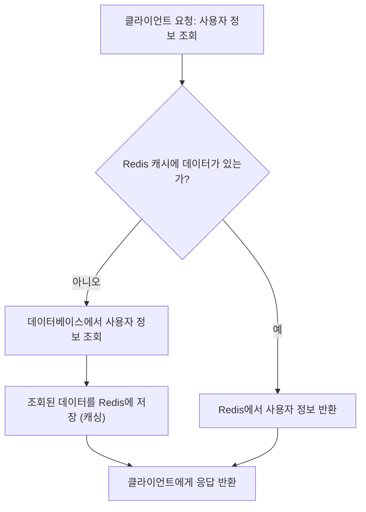

  

# Redis

**Redis (Remote Dictionary Server)** 는 메모리 기반의 key-value 저장소다. 빠른 속도로 데이터를 읽고 쓸 수 있는 `NoSQL` 인메모리 데이터 베이스다.

단순한 저장소에 그치지 않고, 다양한 자료구조와 기능을 갖추고 있어, 캐시, 세션 저장소, 메시지 브로커, 작업 큐 등 다양한 역할로 사용된다.

## 주요 특징

Redis는 데이터 베이스 특징과 조금 특이한 특징들을 갖고 있다.  

1. **메모리 기반 저장소**

	Redis는 데이터를 디스크가 아닌 [[04-memory#^fc21bd|RAM]]에 저장한다. 이러한 구조 덕분에 데이터를 읽고 쓰는 속도가 매우 빠르고, 밀리초 수준의 응답 시간으로 실시간 처리가 필요한 서비스에 적합하다.
	일반적인 디스크 기반 데이터베이스는 I/O 지연이 발생하지만, Redis는 메모리 접근 만으로 처리되므로 데이터베이스 병목 구간을 줄일 수 있다.
 
2. **다양한 자료 구조 지원**

	Redis는 단순한 문자열 저장 뿐 아니라, 리스트, 집합, 해쉬, 정렬된 집합 등을 다양한 자료구조를 제공한다. 이러한 자료형들은 각각 큐, 태그, 사용자 정보, 랭킹 시스템 등으로 응용할 수 있어, 단순한 key-value 저장소를 넘어서 **작은 규모의 구조적 데이터 처리 시스템**으로 확장이 가능하다.
 
3. **TTL 기능**

	TTL(Time To Live)기능은 각 데이터에 대해 만료 시간을 설정할 수 있다. 이 기능을 통해 인증 토큰, 임시 캐시 데이터, 로그인 세션과 같이 **일정 시간 이후 무효화 되어야 하는 데이터를 자동으로 제거**할 수 있게 된다. 이는 시스템의 메모리를 효율적으로 관리할 수 있다는 장점을 갖는다.
 
4. **영속성 옵션 제공**

	Redis는 메모리 기반의 데이터베이스라고 언급했다. 하지만, 데이터를 디스크에 저장하는 기능을 함께 제공한다. 기본적으로 RAM은 전원이나 서버가 꺼지면 초기화 되지만, 이를 통해 데이터를 복구할 수 있으며, 데이터의 신뢰성과 안전성을 동시에 확보 할 수 있다.
 
5. **Pub/Sub 기능**

	Redis는 [[kafka|Kafka]]와 비슷하게 발행(Publish), 구독(Subscribe)를 지원하는 기능을 자체적으로 포함하고 있다. 실시간으로 서버 간 메시지를 전달하거나, 알림 시스템처럼 **즉각적인 데이터 전달이 필요한 서비스를 쉽게 구현**할 수 있는 장점이 있어. 이러한 특징으로 Kafka처럼 무거운 메시지 브로커를 도입하기 어려운 소규모, 내부 통신 구조에서 유용하게 사용된다.

## 사용 이유?

Redis는 단순히 빠른 저장소가 아니다. **백엔드 시스템의 성능과 구조적 복잡도를 동시에 개선할 수 있는 실용적인 도구**다. Redis는 아래의 이유와 배경을 근거로 현재 많이 사용되고 있다.  

1. **데이터를 빠르게 읽고 써야 할 경우**

	서비스의 응답 속도는 사용자 경험과 직결된다. 특히 자주 조회되지만 변경이 드문 데이터 (사용자 프로필, 카테고리 목록 등)은 **매번 DB를 조회하는 것 보다 Redis에서 추출하는게 훨씬 효율적**이다.  
	Redis는 메모리 기반이므로 디스크 기반 DB보다 수십~백 배 빠르게 처리할 수 있기 때문이다.
 
2. **DB 트래픽을 줄이고 성능을 높이고 싶을 경우**

	트래픽이 몰려 모든 요청이 데이터베이스로 들어가면, DB는 과부하 상태에 빠져 전체 시스템이 느려지거나 장애가 발생할 수 있다. 따라서 **Redis는 자주 사용되는 결과를 메모리에 저장**해두고, DB 대신 Redis에서 바로 응답하도록 구성해 **DB의 부담을 줄이고 전체 처리량을 높일 수 있기 때문**이다.
 
3. **서버 간에 데이터를 공유하거나 상태를 유지해야 할 때**

	백엔드 시스템은 보통 여러 대의 서버가 동시에 운영된다. 이 때 로그인 세션, 인증 상태, 실시간 처리 상태 등은 모든 서버에서 **공통으로 접근 가능한 저장소**에 있어야 한다. Redis는 네트워크를 통해 접근 가능한 **중앙 저장소로 사용**되며, 로그인 세션이나 토큰을 저장하는 데 적합한 TTL 기능도 함께 제공해 상태 공유에 이상적인 환경을 구성할 수 있다.
 
4. **실시간성이 중요한 작업을 처리할 때**

	알림 시스템, 실시간 순위표, 채팅 메시지 전달 등 **지연 시간에 매우 민감한 서비스**들에 적합하다. 느린 DB보다는 즉각적인 처리가 가능한 Redis 자료 구조와 Pub/Sub기능을 활용하는 것이 훨씬 효과적이다.

| 목적       | Redis                      |
| -------- | -------------------------- |
| 빠른 읽기/쓰기 | 캐시로 사용하여 응답 속도 개선          |
| DB 부하 분산 | 트래픽을 Redis로 오프로드           |
| 상태 공유    | 세션, 인증 상태 등을 중앙에서 관리       |
| 실시간 처리   | 빠른 처리와 다양한 자료구조로 실시간 기능 구현 |

## Redis Process

## 사용 예제

Redis는 많은 서비스 프로젝트에 많이 사용되는데, 이와 같다.  

1. **뉴스 피드 캐시**

	SNS 에서 뉴스피드를 구성할 때, 사용자가 팔로우한 수많은 게시글을 실시간으로 정렬하는 것은 큰 부담이 된다.  
	이때 미리 정리된 게시글 목록을 사용자 별로 `id list`를 Redis에 저장해두고, 사용자가 앱을 열 때 바로 꺼내서 보여준다.  
	이런 방식을 통해 불필요한 계산 없이 빠른 응답이 가능하게 된다.

2. **로그인 세션 저장소**

	여러 대의 서버에서 서비스를 운영할 때, 로그인 상태를 각 서버가 개별로 관리하면 문제가 발생한다. 이때 Redis에 로그인 세션을 저장하면, 어느 서버에서든 일관된 인증 상태를 확인할 수 있다.  
	또한 Redis의 TTL 기능을 통해 세션 만료 시간도 자동으로 관리할 수 있다.

3. **작업 큐**

	이미지 처리나 이메일 발송처럼 시간이 걸리는 작업은 Redis에 요청을 저장해두고, 다른 프로세스가 이를 읽어가면서 처리할 수 있다. 서버의 부담을 줄이고 처리 속도를 향상시킬 수 있기 때문.

4. **실시간 랭킹 시스템**

	게임이나 쇼핑몰에서 인기 상품이나 사용자 순위를 보여줄 때, redis의 `sorted set`을 사용하면 점수 기준으로 빠르게 순위를 계산하고, 보여줄 수 있다.

# Redis는 단순한 캐시를 넘는다

Redis는 단순히 빠른 저장소가 아니다.  
**백엔드 시스템의 병목을 해소하고, 구조를 더 유연하게 설계할 수 있도록 돕는 핵심 구성 요소**다.

단일 기능을 넘어 다양한 역할을 유연하게 수행하며,  
**하나의 기술로 성능, 안정성, 확장성 세 가지를 동시에 확보할 수 있는 전략적 도구**로 자리 잡았다.

즉, **속도 문제와 구조적 복잡도를 동시에 해결하려면**,  
Redis는 단순히 선택이 아닌, **백엔드에서 반드시 익혀야 할 필수 도구**에 가깝다.
   
# 참고자료
