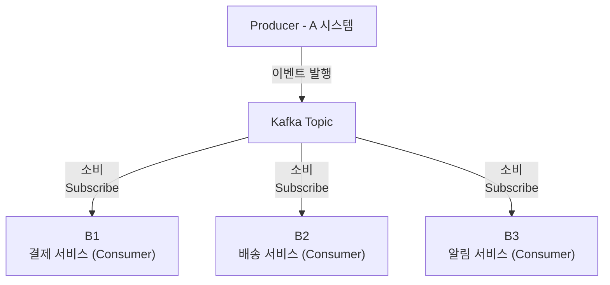
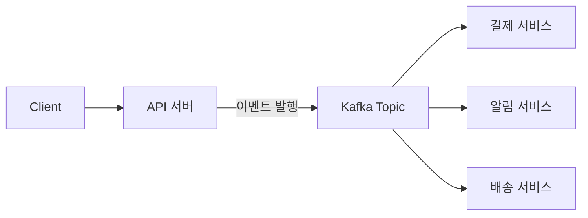

<p align="center">
  
</p>

# 카프카

Kafka는 단순한 메시지 큐가 아니다. Kafka는 오늘날 대규모 데이터 환경에서 **시스템 간 통신 방식 자체를 근본적으로 바꾼 아키텍처**다. Kafka의 핵심부터 실제 마이크로서비스 아키텍처 (MSA) 에서의 활용 방식, 그리고 동기 REST API 방식과의 비교를 통해 Kafka가 왜 필요한지, 어떤 tradeoff가 있는지 알아보자

## 정의

Kafka는 원래 LinkedIn에서 개발하였습니다. 2010년 경, 수많은 사용자 행동 로그, 클릭 이벤트 등을 효율적으로 수집하고 처리할 수단이 필요했는데, 당시 메시징 시스템들은 확장성과 처리량, 장애 복원성 면에서 한계가 존재했다.

LinkendIn은 이를 해결하기 위해서 **분산 로그 기반 메시징 시스템**인 **Kafka**를 설계하였고, 2011년에 Apache Software Foundation을 통해 오픈소스화하였다. 이후 Kafka는 **실시간 스트리밍**, **이벤트 기반 시스템**, **데이터 파이프라인 구축**의 "표준 기술"이 되었다.

Kafka라는 이름은 소설가 **프란츠 카프카(Franz Kafka)** 에서 따온 것으로 알려져 있다. 소설가처럼 데이터를 기록하고, 흘려 보낸다는 로그 기반 철학과 동일하다.

Kafka는 **분산 메시징 시스템**이다. 여러 시스템 간 데이터를 주고 받을 때, **비동기적으로 메시지를 전달**해주는 **중간자** 역할을 한다. Kafka는 다음과 같은 구조로 동작한다.



A 시스템은 Kafka에 이벤트를 발행 (Publish)하고, B 시스템은 Kafka에서 데이터를 구독(Subscribe) 해서 가져간다. 즉, **발행 시점과 소비 시점이 분리**되기 때문에, 서비스 간 **느슨한 결합**과 **병렬 처리**가 **가능**해진다.

## 핵심 구성 요소

| 구성요소      |                                          |
| --------- | ---------------------------------------- |
| Producer  | Kafka에 메시지를 발행하는 주체                      |
| Broker    | Kafka서버, Topic과 Partition을 관리하고, 메시지를 저장 |
| Topic     | 메시지를 분류하는 논리적 단위                         |
| Partition | Topic 내부의 메시지를 분산, 저장하는 단위 (병렬 처리의 핵심)   |
| Offset    | 메시지의 순서를 식별하는 번호                         |
| Consumer  | 메시지를 구독하고 처리하는 주체                        |

이렇게 만 보면, 좀 어렵다. 예제를 들면 아래와 같다.  

### 구성 요소 별 적용 예시

일반적으로 우리가 쇼핑몰 사이트에서 주문을 하는 것에 대해 생각해보자.  
Client는 사이트에서 주문을 요청한다. 요청된 주문서가 어떻게 되는지 보자.

| 구성요소      | 역할             | 예시                                                                                    |
| --------- | -------------- | ------------------------------------------------------------------------------------- |
| Producer  | 메시지를 Kafka에 발행 | 주문 서버(`order-api`)가 주문 발생(`order.created`) 이벤트를 Kafka에 보냄                             |
| Broker    | 메시지를 저장 및 분배   | Kafka 서버가 `order-topic`을 관리하며 메시지 저장                                                  |
| Topic     | 메시지 분류 단위      | `order-topic`에 주문 관련 이벤트를 저장                                                          |
| Partition | 메시지 분산 저장 단위   | 주문 ID를 기준으로 여러 Partition에 분산 저장                                                       |
| Offset    | 파티션 내 메시지 순서   | 각 Partition에서 메시지는 Offset 0, 1, 2.. 순서로 저장                                            |
| Consumer  | 메시지를 읽는 주체     | `payment-service`, `inventory-service`,`notification-service`가 `order-topic`을 구독하여 처리 |

```
[Client] → 주문 요청
    ↓
[Order API (Producer)] → Kafka (Broker)
    → Topic: order-topic
      → Partition 0: 주문 ID 1001 (Offset 0)
      → Partition 1: 주문 ID 1002 (Offset 0)
      → Partition 2: 주문 ID 1003 (Offset 0)

[Payment Service (Consumer)] → order-topic 구독 → 결제 처리
[Inventory Service (Consumer)] → order-topic 구독 → 재고 차감
[Notification Service (Consumer)] → order-topic 구독 → 고객 알림
```

## 언제 사용할까?

Kafka는 분산 메시징 시스템이고, 해당 시스템들이 "순서"에 상관없이 가능한 시스템부터 메시지를 수집해 운영하는 형식이다. 즉, 비동기 통신 시스템이고 여러 시스템이 많은 대규모 시스템, 혹은 확장 가능성이 높은 프로젝트에 어울린다.  

- 실시간 로그 수집 시스템
- 쇼핑몰 주문/결제 이벤트 흐름 분리
- 마이크로서비스 간 비동기 통신
- 이벤트 기반 시스템 설계 (EDA)
- 데이터 파이프라인 구성 (ETL)

Kafka는 특히 하나의 이벤트가 여러 하위 서비스로 확산되는 경우 **Fan-out 구조**를 완벽하게 지원하는 특징을 갖는다.

## 작동 방식: REST API와 차이

우리가 프로젝트를 할 때 구성하는 REST API와 Kafka는 약간의 차이가 있다. 크게 순차, 확장성, 그리고 데이터 의존성에 차이가 존재한다.

### REST API


REST API는 "순차" 적으로 진행된다. Client가 API서버에 요청을 하면 그에 맞는 서비스가 진행되고, 그리고 알림 서비스... 이렇게 운영된다. 각 데이터 간 의존성이 없더라도, 각 서비스의 순차적으로 진행된다.

- 모든 처리를 한 번에 실행해야 한다.
- 장애 위험이 높다
- 응답이 느려지면 전체 흐름이 지연된다.
- 요청에 대한 응답이 절대적이다.

### Kafka



REST API와 다르게 Kafka는 분할로 서비스가 진행된다. 각 데이터 간 의존성이 있으면 서비스 구조나 진행에 어렵거나 오류가 날 상황이 많지만 그게 아니라면 확장성에 감안하면 Kafka를 사용하는게 좋다.

- 메시지 한 번 발행으로 여러 서비스 병렬 처리
- 결합도가 낮고 확장성이 높다
- 장애 격리가 가능하다
- 응답이 존재하지 않는다.

## 마이크로서비스(MSA)의 적합성

1. **서비스 간 결합도를 제거할 수 있다.** : Kafka를 통해 시스템 간 직접 호출 없이 메시지로 연결 가능
2. **확장성** : Consumer를 추가하기만 하면 새로운 서비스도 쉽게 참여
3. **병렬성** : 여러 서비스가 동시에 같은 메시지를 처리한다. (Fan-out)
4. **복원력** : 메시지를 Kafka에 저장하므로 실패 시 재처리 가능하다.  
5. **유연성** : 신규 서비스 도입/변경 시 기존 코드 수정 없이 가능
6. **이벤트 소싱 및 CQRS와의 결합 가능성** : 도메인 이벤트를 기반으로 상태를 유지하는 설계에 적합


## 단점과 한계

비동기적 처리도 가능하고, 분산 처리에 확장성, 유연성 모든 장점이 있는 것 같은 Kafka도 Tradeoff 상황에 있다는 것을 명시해야 한다.

| 단점            |                                          |
| ------------- | ---------------------------------------- |
| 요청-응답 구조가 아님  | Kafka는 응답이 없어 사용자 결과 확인 불가               |
| 순차성 제어가 어렵다   | 메시지는 순서대로 저장, 처리 순서는 각 서비스 별 다름          |
| 상태 추적/모니터링 복잡 | 성공/실패 여부를 따로 관리 (ex.상태 DB 필요)            |
| 설계 난이도 높음     | Topic 설계, Offset 관리, 메시지 중복 처리 등 고려사항 많음 |
| 단순한 구조에 과함    | 소규모 처리엔 오버 엔지니어링                         |

### Kafka 선택 기준

따라서 Kafka는 프로젝트의 상황과 연산 주제에 따라 다르다.

| 상황                  |                     |
| ------------------- | ------------------- |
| 하나의 이벤트, 여러 서비스로 분기 | O                   |
| 각 서비스가 독립적인 처리      | O                   |
| 처리 결과가 실시간으로 필요     | X REST API          |
| 순서 보장이 엄격히 필요       | X 직접 처리 흐름 제어       |
| 서비스 간 트랜잭션이 필요      | X REST API, SAGA 패턴 |

# 결론

Kafka는 결과를 직접 돌려주지 않지만, 그 대신 **대규모 트래픽**을 유연하게 처리하고, **서비스 간 결합도를 낮추고**, **병렬 처리**와 **이벤트 중심 구조**를 통해 MSA의 이상적인  확장을 가능하게 한다.  

즉, Kafka는 **결과를 바로 얻는 구조**가 아니라 **데이터 흐름을 유연하게 만드는 구조**다. REST API는 빠르고 직관적인 단일 흐름에 적합하고, kafka는 복잡하고 유연한 시스템 통합에 유리하다. 

즉, 빠른 응답보다 **유연한 흐름**, 단일 처리보다 **확장 가능한 이벤트 중심 구조**를 고민한다면 Kafka는 강력한 선택지가 될 것이다.

</br></br></br>
# 참고자료
- [Apache Kafka 공식 문서](https://kafka.apache.org/)
- [Red Hat: Kafka란 무엇인가](https://www.redhat.com/ko/topics/integration/what-is-apache-kafka)
- [우아한형제들 기술블로그: Kafka의 구조와 활용](https://techblog.woowahan.com/17386/)
- [Confluent Kafka Tutorials](https://developer.confluent.io/learn-kafka/)
- [Kafka vs RabbitMQ 비교 by IBM](https://developer.ibm.com/articles/compare-apache-kafka-vs-rabbitmq/)