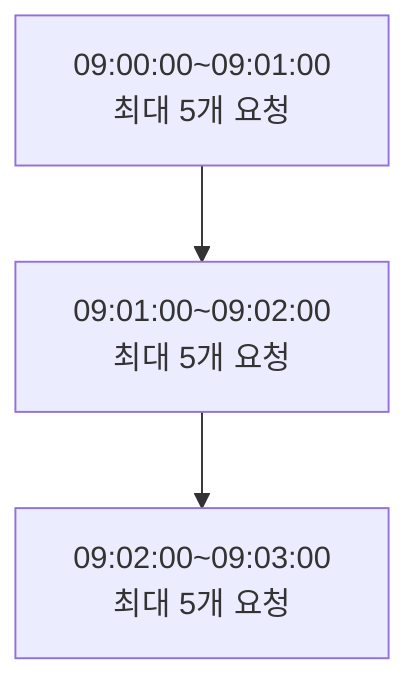
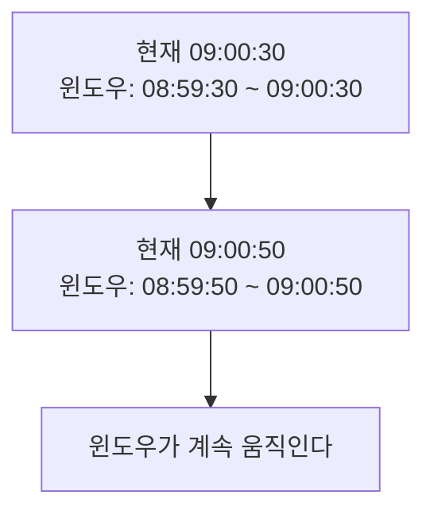

<p align="center">  </p>

# Rate Limiting

좋아하는 카페에 가서 커피를 주문한다고 생각해보자. 바리스타가 한 명뿐인데 갑자기 100명이 몰려와서 동시에 주문한다면? 카페는 아수라장이 되고, 바리스타는 과로로 쓰러질 것이다.

웹 서버도 마찬가지다. 무제한으로 요청을 받으면 서버가 다운되거나 정상적인 사용자들까지 피해를 본다. 이때 필요한 게 바로 **Rate Limiting** - 서버의 똑똑한 문지기 역할을 하는 기술이다.

## Rate Limiting이 뭔가?

**"특정 시간 동안 허용되는 요청의 수를 제한하는 기술"**

일상생활에서 이미 우리는 Rate Limiting을 경험하고 있다:

- **카페**: "바리스타 1명, 1분에 커피 5잔까지만 제작 가능"
- **은행 창구**: "한 명당 하루에 5번까지만 업무 가능"
- **엘리베이터**: "최대 10명까지만 탑승 가능"
- **놀이공원**: "인기 어트랙션 1시간 대기"

### 왜 필요할까?

Rate Limiting이 해결하는 문제들을 보면:

- **서버 보호**: 과부하로 인한 다운 방지 - 서버가 감당할 수 있는 만큼만 처리
- **공정성**: 모든 사용자에게 균등한 기회 제공 - 한 명이 독점하지 못하게
- **비용 관리**: 클라우드 리소스 사용량 제어 - AWS 요금 폭탄 방지
- **남용 방지**: 스팸, DDoS 공격 차단 - 악의적인 사용자로부터 보호

## 3가지 핵심 알고리즘

Rate Limiting에는 대표적으로 3가지 알고리즘이 있다. 각각 다른 방식으로 "문지기" 역할을 한다.

### 1. Fixed Window



시간을 **고정된 구간**으로 나누어 각 구간마다 요청 개수를 제한하는 방식이다.

**카페 예시로 이해하기**: "매 시간 정각부터 5개 주문만 받는다!"

- 09:00~10:00: 최대 5개
- 10:00~11:00: 최대 5개 (새로 리셋)

#### 핵심 구현 로직

```python
def is_allowed(self, identifier: str) -> Dict[str, Any]:
    current_time = int(time.time())  # 현재 시간
    window_seconds = 60  # 1분 윈도우
    
    # 윈도우 시작점 계산이 핵심!
    window_start = (current_time // window_seconds) * window_seconds
    
    redis_key = f"fixed_window:{identifier}:{window_start}"
    current_count = self.redis.get(redis_key) or 0
    
    if int(current_count) >= self.limit:
        return {"allowed": False}  # 제한 초과
    
    # 카운터 증가 및 만료시간 설정
    self.redis.incr(redis_key)
    self.redis.expire(redis_key, window_seconds)
    return {"allowed": True}
```

**장점**: 구현이 간단하고 빠르다, 메모리를 적게 사용한다

**단점**: **윈도우 경계 문제** - 짧은 시간에 제한의 2배까지 요청이 몰릴 수 있다

#### 경계 문제 예시

```
09:00:50 → 5개 요청 (윈도우1에서 허용)
09:01:10 → 5개 요청 (윈도우2에서 허용)
실제 결과: 20초 안에 10개! → 서버 과부하 위험
```

### 2. Sliding Window


**현재 시점을 기준**으로 과거 일정 시간 동안의 요청 수를 제한하는 방식이다.

**카페 예시**: "지금부터 1시간 전까지 주문 기록을 확인해서 5개 넘으면 거절!"

#### 핵심 구현 로직

```python
def is_allowed(self, identifier: str) -> Dict[str, Any]:
    current_time = time.time()
    window_start = current_time - self.window_seconds  # 1분 전
    
    redis_key = f"sliding_window:{identifier}"
    
    # Lua 스크립트로 원자적 연산 (동시성 문제 해결)
    lua_script = """
    -- 1. 윈도우 밖의 오래된 요청들 제거
    redis.call('ZREMRANGEBYSCORE', KEYS[1], 0, ARGV[1])
    
    -- 2. 현재 윈도우 내 요청 수 확인
    local count = redis.call('ZCARD', KEYS[1])
    if count >= tonumber(ARGV[3]) then return 0 end
    
    -- 3. 새 요청 추가
    redis.call('ZADD', KEYS[1], ARGV[2], ARGV[2])
    return 1
    """
    
    result = self.redis.eval(lua_script, 1, redis_key, 
                           window_start, current_time, self.limit)
    return {"allowed": bool(result)}
```

**장점**: 정확한 제한, 경계 문제 완전 해결

**단점**: 구현이 복잡하고 메모리를 많이 사용한다 (모든 요청 시간을 저장)

#### 경계 문제 해결

```
09:00:50에 5개, 09:01:10에 5개 요청시:
→ 09:01:10 윈도우는 09:00:10~09:01:10
→ 이미 5개가 있으므로 새로운 5개는 거절! ✅
```

### 3. Token Bucket


**토큰이 담긴 버킷**을 이용해 요청을 제어하는 방식이다.  
**카페 예시**: "커피 쿠폰 5개를 미리 드린다. 쿠폰 있으면 즉시 주문 가능하고, 1분마다 쿠폰 1개씩 다시 드린다!"

#### 핵심 구현 로직

```python
def is_allowed(self, identifier: str, tokens_needed: int = 1) -> Dict[str, Any]:
    current_time = time.time()
    
    # 토큰 충전 계산
    elapsed = current_time - last_refill_time
    new_tokens = min(capacity, current_tokens + elapsed * refill_rate)
    
    # 토큰 부족 체크
    if new_tokens < tokens_needed:
        return {"allowed": False, "retry_after": wait_time}
    
    # 토큰 소비
    remaining_tokens = new_tokens - tokens_needed
    return {"allowed": True, "remaining": remaining_tokens}
```

**특별한 장점: 버스트 허용**

```
평상시: 🪣 [●●●●●] (토큰 5개 축적)
갑자기 요청 몰림: 🪣 [_____] (모든 토큰 사용 가능!)
→ 일시적 버스트는 허용하되, 장기적으로는 제한
```

**장점**: 버스트 허용으로 사용자 경험이 좋다, 유연하다   
**단점**: 순간적 과부하 가능성

## 실제 구현해보기: Python + Redis

이제 이론을 실제 코드로 만들어보자. 전체 구현 코드는 [GitHub 레포지토리](https://github.com/kikiru328/TIL/tree/main/Backends/RateLimiting)에서 확인할 수 있다.

### 프로젝트 설정

```python
# pyproject.toml
[project]
dependencies = [
    "fastapi (>=0.115.14,<0.116.0)",
    "uvicorn (>=0.35.0,<0.36.0)", 
    "redis (>=6.2.0,<7.0.0)"
]
```

### 공통 인터페이스

```python
# rate_limiters/__init__.py
from abc import ABC, abstractmethod
from typing import Dict, Any

class RateLimiterInterface(ABC):
    @abstractmethod
    def is_allowed(self, identifier: str) -> Dict[str, Any]:
        pass
    
    @abstractmethod
    def get_algorithm_name(self) -> str:
        pass
```

### Fixed Window 구현

```python
# rate_limiters/fixed_window.py
class FixedWindowRateLimiter(RateLimiterInterface):
    def __init__(self, redis_client, limit: int = 5, window_seconds: int = 60):
        self.redis = redis_client
        self.limit = limit
        self.window_seconds = window_seconds
        
    def is_allowed(self, identifier: str) -> Dict[str, Any]:
        current_time = int(time.time())
        window_start = (current_time // self.window_seconds) * self.window_seconds
        redis_key = f"fixed_window:{identifier}:{window_start}"
        
        current_count = self.redis.get(redis_key) or 0
        
        if int(current_count) >= self.limit:
            return {
                "allowed": False,
                "remaining": 0,
                "retry_after": (window_start + self.window_seconds) - current_time,
                "algorithm": "fixed_window"
            }
            
        # 원자적 연산으로 카운터 증가
        pipe = self.redis.pipeline()
        pipe.incr(redis_key)
        pipe.expire(redis_key, self.window_seconds)
        pipe.execute()
        
        return {
            "allowed": True,
            "remaining": self.limit - (int(current_count) + 1),
            "algorithm": "fixed_window"
        }
```

## 진짜 테스트 결과: 알고리즘별 차이점 확인

이론만으로는 부족하다. 직접 테스트해본 결과를 보자!

### 연속 요청 테스트 (5개 제한, 6개 요청)

```python
# 모든 알고리즘에서 동일한 결과
# [✅✅✅✅✅❌] - 처음 5개 허용, 6번째 거절
```

### 시간 경과 후 테스트 (3초 후)

```
Fixed Window:    ❌ (같은 윈도우 내라서 거절)
Sliding Window:  ✅ (일부 요청이 윈도우에서 제거됨)
Token Bucket:    ✅ (토큰 3개 충전됨)
```

**이게 핵심 차이점이다!** Fixed Window는 윈도우가 리셋될 때까지 무조건 기다려야 하지만, 나머지 두 알고리즘은 시간이 지나면서 점진적으로 허용량이 회복된다.

### 경계 문제 테스트

실제로 윈도우 경계에서 테스트해본 결과:

```python
# test_real_boundary.py 실행 결과
Fixed Window - 경계 문제:
  윈도우 끝에 5개 요청: [✅✅✅✅✅]
  새 윈도우 시작에 5개 요청: [✅✅✅✅✅]
  결과: 20초 안에 10개 허용! (원래는 1분에 5개 제한)

Sliding Window - 문제 해결:
  첫 5개 요청: [✅✅✅✅✅]
  즉시 5개 더 요청: [❌❌❌❌❌]
  결과: 정확히 5개만 허용 ✅
```

이 테스트를 직접 실행해보면 정말 충격적이다. Fixed Window는 경계에서 제한의 2배까지 허용하는 치명적인 문제가 있다!

### Token Bucket의 버스트 허용 테스트

```python
# 5개 토큰이 가득 찬 상태에서
result = limiter.is_allowed("user", tokens_needed=5)  # 5개 한번에 소비
print(f"5개 토큰 소비: {result['allowed']}")  # True

result = limiter.is_allowed("user")  # 바로 추가 요청
print(f"추가 요청: {result['allowed']}")  # False (토큰 부족)
```

Token Bucket만이 **"저축된 토큰"으로 순간적인 대량 요청을 허용할** 수 있다.

## 실무에서의 선택 기준: 상황별 최적 알고리즘

|상황|추천 알고리즘|이유|
|---|---|---|
|로그인 시도 제한|Fixed Window|간단하고 강력, 보안 중시|
|결제 API|Sliding Window|정확성이 중요, 돈과 관련|
|파일 업로드|Token Bucket|버스트 허용, 사용자 경험|
|일반 API|Fixed Window|성능 우선, 간단함|
|실시간 채팅|Token Bucket|유연한 패턴 허용|

### 각 알고리즘의 트레이드오프

|기준|Fixed Window|Sliding Window|Token Bucket|
|---|---|---|---|
|**구현 난이도**|쉽다|어렵다|보통|
|**정확성**|낮다|높다|보통|
|**메모리 사용량**|적다|많다|적다|
|**사용자 경험**|나쁘다|예측가능|좋다|
|**성능**|빠르다|느리다|보통|

## 실제 구현에서 중요한 포인트들

### 1. Redis + Lua 스크립트는 필수다

```python
# 여러 Redis 명령어를 하나로 묶어 원자적 연산 보장
lua_script = """
redis.call('ZREMRANGEBYSCORE', KEYS[1], 0, ARGV[1])
local count = redis.call('ZCARD', KEYS[1])
if count >= tonumber(ARGV[3]) then return 0 end
redis.call('ZADD', KEYS[1], ARGV[2], ARGV[2])
return 1
"""
```

**왜 필요한가?** 동시에 여러 요청이 와도 정확한 계산을 보장한다.

### 2. 알고리즘별 메모리 사용량

```
Fixed Window: key → 숫자 (4바이트)
Sliding Window: key → 모든 요청 시간들 (시간 * 8바이트)  
Token Bucket: key → {tokens, last_refill} (16바이트)
```

대규모 서비스에서는 메모리 사용량이 비용에 직결된다.

### 3. 동시성 문제 해결

Race Condition을 방지하기 위해:

- Redis Pipeline 사용
- Lua 스크립트로 원자적 연산
- 적절한 만료시간 설정

## 실제 서비스에 적용한다면?

### 단계적 접근법

1. **1단계**: Fixed Window로 빠르게 시작 (학습 + 기본 보호)
2. **2단계**: 문제 발생시 Sliding Window로 업그레이드
3. **3단계**: 사용자 경험 개선을 위해 Token Bucket 도입
4. **4단계**: 서비스별 하이브리드 조합

### 하이브리드 예시

```
로그인 실패: Fixed Window (단순, 강력)
결제 API: Sliding Window (정확성 중요)  
파일 업로드: Token Bucket (버스트 허용)
```

현실에서는 하나의 알고리즘만 사용하지 않는다. 각 API의 특성에 맞게 다른 알고리즘을 조합해서 사용한다.

## 결론

Rate Limiting은 결과를 직접 돌려주지 않지만, 그 대신 **대규모 트래픽**을 유연하게 처리하고, **서버를 보호하고**, **공정한 서비스**를 제공하는 핵심 기술이다.  

**"모든 자원은 유한하다."**

Rate Limiting은 제한된 자원을 **공정하고 안전하게** 분배하는 핵심 기술이다. 빠른 응답보다 **안정적인 서비스**, 단순한 구현보다 **상황에 맞는 선택**을 고민한다면 Rate Limiting은 강력한 도구가 될 것이다.

마지막으로, 이론만 아는 것과 직접 구현해보는 것은 완전히 다르다. [GitHub 레포지토리](https://github.com/kikiru328/TIL/tree/main/Backends/RateLimiting)의 코드를 직접 실행해보고, 각 알고리즘의 차이점을 몸소 느껴보길 추천한다.

그때서야 진정한 Rate Limiting의 매력을 알게 될 것이다.

</br></br></br>
# 참고자료

- [GitHub 구현 코드](https://github.com/kikiru328/TIL/tree/main/Backends/RateLimiting)
- [Redis 공식 문서](https://redis.io/docs/)
- [Rate Limiting Algorithms - Token Bucket vs Fixed Window vs Sliding Window](https://blog.bytebytego.com/p/rate-limiting-algorithms-explained)
- [Netflix의 Rate Limiting 전략](https://netflixtechblog.com/performance-under-load-3e6fa9a60581)
- Claude.ai
