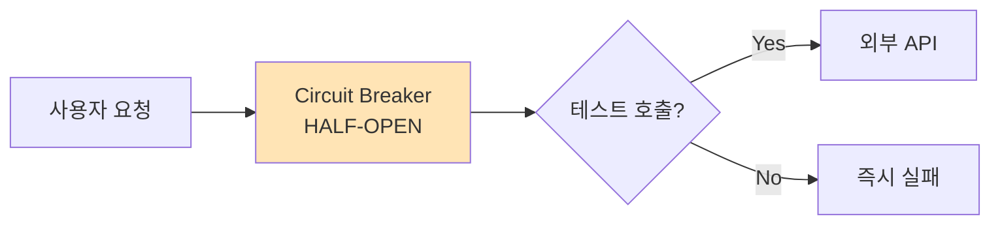

<p align="center">  </p>

# Circuit Breaker

친구에게 전화를 걸었는데 계속 안 받는다면 어떻게 할까? 처음엔 "어? 바쁜가?" 하며 몇 번 더 걸어보겠지만, 10번째도 안 받으면 "아, 폰이 꺼져있나 보다. 나중에 다시 걸어봐야지"라고 생각하게 된다.

웹 서비스도 마찬가지다. 외부 API가 죽었는데 계속 호출하면? 서버 리소스만 낭비하고 사용자는 무한 로딩만 보게 된다. 이때 필요한 게 바로 **Circuit Breaker** - 똑똑한 전기 차단기처럼 장애를 감지하고 추가 피해를 막아주는 패턴이다.

## Circuit Breaker가 뭔가?

**"외부 서비스 장애 시 추가 호출을 차단해서 시스템을 보호하는 패턴"**

실제 전기 차단기에서 아이디어를 가져왔다. 전기 과부하가 걸리면 차단기가 "딸깍" 하고 전원을 끊어버리듯이, API 호출도 장애 감지 시 즉시 차단한다.

### 일상 속 Circuit Breaker

우리는 이미 무의식적으로 Circuit Breaker를 사용하고 있다:

- **엘리베이터**: 고장 나면 "점검 중" 표시하고 사용 금지
- **ATM**: 장애 시 "서비스 일시 중단" 안내
- **배달 앱**: 특정 매장 주문 실패 시 "주문 불가" 표시
- **지하철**: 고장 구간 운행 중단 후 복구 테스트

## 왜 필요할까?

Circuit Breaker가 해결하는 문제들을 보면:

- **리소스 보호**: 죽은 API에 계속 요청하며 서버 리소스 낭비 방지
- **빠른 실패**: 타임아웃까지 기다리지 않고 즉시 실패 처리
- **사용자 경험**: "로딩 중..." 대신 "일시 중단" 같은 명확한 안내
- **복구 시간 확보**: 외부 서비스가 회복할 시간을 벌어줌

### 실제 상황으로 이해하기

**결제 시스템 예시**:

```bash
Circuit Breaker 없을 때:
사용자 A: 결제 버튼 클릭 → 30초 로딩 → 실패
사용자 B: 결제 버튼 클릭 → 30초 로딩 → 실패
사용자 C: 결제 버튼 클릭 → 30초 로딩 → 실패
...

Circuit Breaker 있을 때:
사용자 A: 결제 버튼 클릭 → 30초 로딩 → 실패 (학습)
사용자 B: 결제 버튼 클릭 → 즉시 "결제 서비스 점검 중" 메시지
사용자 C: 결제 버튼 클릭 → 즉시 "결제 서비스 점검 중" 메시지
```

## 3가지 상태: 전기 차단기의 동작 원리

Circuit Breaker는 전기 차단기처럼 3가지 상태를 가진다.

### 1. CLOSED (닫힌 상태) - 정상 운영


- **의미**: "전기가 정상적으로 흐르는 상태"
- **동작**: 모든 요청을 외부 API로 그대로 전달
- **모니터링**: 실패 횟수를 계속 카운트하며 감시 중

**카페 예시**: "평상시에는 모든 주문을 받는다"

### 2. OPEN (열린 상태) - 차단 중


- **의미**: "차단기가 열려서 전기가 안 흐르는 상태"
- **동작**: 모든 요청을 즉시 차단하고 에러 반환
- **목적**: 외부 API 호출 없이 빠른 실패 처리

**카페 예시**: "커피머신 고장으로 주문 받지 않음"

### 3. HALF-OPEN (반열린 상태) - 복구 테스트



- **의미**: "복구되었는지 조심스럽게 테스트하는 상태"
- **동작**: 제한된 수의 요청만 외부 API로 전달
- **판단**: 성공하면 CLOSED로, 실패하면 다시 OPEN으로

**카페 예시**: "커피머신 수리 후 한 잔씩 테스트해보기"

## 상태 전환의 마법: 자동 복구 시스템

### 전환 조건

```python
# 핵심 전환 로직
if failure_count >= failure_threshold:  # 예: 5회 실패
    state = OPEN  # 차단 모드로
    
if current_time - last_failure_time > timeout:  # 예: 30초 후
    state = HALF_OPEN  # 테스트 모드로
    
if test_success:
    state = CLOSED  # 정상 모드로 복귀
else:
    state = OPEN  # 다시 차단 모드로
```

### 상태 전환 시나리오

**정상 → 장애 감지**:
```
CLOSED → 실패 5회 누적 → OPEN
```
**복구 테스트 시작**:
```
OPEN → 30초 경과 → HALF-OPEN
```
**테스트 결과에 따른 분기**:
```
HALF-OPEN → 성공 → CLOSED (완전 복구)
HALF-OPEN → 실패 → OPEN (아직 장애 중)
```

## 실제 코드로 구현해보기

이론만으로는 부족하다. 직접 동작하는 Circuit Breaker를 만들어보자.

### 기본 구조

```python
import time
from enum import Enum

class State(Enum):
    CLOSED = 1      # 정상: 모든 요청 허용
    OPEN = 2        # 차단: 모든 요청 거부  
    HALF_OPEN = 3   # 테스트: 제한적 허용

class CircuitBreaker:
    def __init__(self, failure_threshold=5, timeout=30):
        # 현재 상태 (초기값: 정상)
        self.state = State.CLOSED
        
        # 실패 추적 변수들
        self.failure_count = 0              # 연속 실패 횟수
        self.last_failure_time = 0          # 마지막 실패 시간
        
        # 설정값들
        self.failure_threshold = failure_threshold  # 실패 허용 한계 (5회)
        self.timeout = timeout              # OPEN 상태 유지 시간 (30초)
```

### 핵심 호출 로직
```python
def call(self, func, *args, **kwargs):
    """
    외부 API 호출을 Circuit Breaker로 감싸는 메인 함수
    """
    # 1단계: 현재 상태에 따른 처리
    if self.state == State.OPEN:
        # 차단 상태: 복구 시간이 됐는지 확인
        if time.time() - self.last_failure_time > self.timeout:
            print("🔄 복구 테스트 모드로 전환")
            self.state = State.HALF_OPEN
        else:
            # 아직 차단 시간이므로 즉시 실패
            remaining = self.timeout - (time.time() - self.last_failure_time)
            raise Exception(f"🚫 Circuit Breaker OPEN (복구까지 {remaining:.1f}초)")
    
    # 2단계: 실제 API 호출 시도
    try:
        print(f"📡 API 호출 시도 (상태: {self.state.name})")
        result = func(*args, **kwargs)
        self._on_success()  # 성공 처리
        return result
    except Exception as e:
        self._on_failure()  # 실패 처리
        raise e

def _on_success(self):
    """
    호출 성공 시: 모든 카운터 리셋하고 정상 상태로
    """
    print("✅ 호출 성공 - 정상 상태로 복귀")
    self.failure_count = 0
    self.state = State.CLOSED

def _on_failure(self):
    """
    호출 실패 시: 카운터 증가하고 임계점 확인
    """
    self.failure_count += 1
    self.last_failure_time = time.time()
    
    print(f"❌ 호출 실패 ({self.failure_count}/{self.failure_threshold})")
    
    # 실패 임계치 도달하면 차단 모드로 전환
    if self.failure_count >= self.failure_threshold:
        print("🔴 Circuit Breaker OPEN - 호출 차단 시작")
        self.state = State.OPEN
```

### 실제 테스트해보기
```python
def unstable_payment_api(amount):
    """
    불안정한 결제 API 시뮬레이션
    70% 확률로 실패하는 상황
    """
    import random
    
    print(f"💳 결제 요청: {amount}원")
    time.sleep(0.5)  # API 호출 시간 시뮬레이션
    
    if random.random() < 0.7:  # 70% 확률로 실패
        raise Exception("결제 서버 연결 실패")
    
    return f"결제 성공: {amount}원"

# Circuit Breaker 생성 (3회 실패 시 차단, 10초 후 복구 테스트)
cb = CircuitBreaker(failure_threshold=3, timeout=10)

# 실제 테스트 실행
print("=== Circuit Breaker 테스트 시작 ===\n")

for i in range(8):
    print(f"\n--- 요청 {i+1} ---")
    try:
        result = cb.call(unstable_payment_api, 1000)
        print(f"🎉 결과: {result}")
    except Exception as e:
        print(f"💥 실패: {e}")
    
    time.sleep(2)  # 요청 간격
```

### 테스트 실행 결과

```
=== Circuit Breaker 테스트 시작 ===

--- 요청 1 ---
📡 API 호출 시도 (상태: CLOSED)
💳 결제 요청: 1000원
❌ 호출 실패 (1/3)
💥 실패: 결제 서버 연결 실패

--- 요청 2 ---
📡 API 호출 시도 (상태: CLOSED)
💳 결제 요청: 1000원
❌ 호출 실패 (2/3)
💥 실패: 결제 서버 연결 실패

--- 요청 3 ---
📡 API 호출 시도 (상태: CLOSED)
💳 결제 요청: 1000원
❌ 호출 실패 (3/3)
🔴 Circuit Breaker OPEN - 호출 차단 시작
💥 실패: 결제 서버 연결 실패

--- 요청 4 ---
💥 실패: 🚫 Circuit Breaker OPEN (복구까지 8.0초)

--- 요청 5 ---
💥 실패: 🚫 Circuit Breaker OPEN (복구까지 6.0초)

--- 요청 6 ---
🔄 복구 테스트 모드로 전환
📡 API 호출 시도 (상태: HALF_OPEN)
💳 결제 요청: 1000원
✅ 호출 성공 - 정상 상태로 복귀
🎉 결과: 결제 성공: 1000원
```

**이게 핵심이다!** Circuit Breaker는 3번 실패 후 즉시 차단 모드로 들어가서 불필요한 API 호출을 막았다. 그리고 10초 후 자동으로 복구 테스트를 시작해서 서비스가 정상화되면 즉시 복구했다.

## Rate Limiting과 뭐가 다른가?

둘 다 요청을 제어하지만 **목적과 동작 방식**이 완전히 다르다.

### 핵심 차이점

|구분|Rate Limiting|Circuit Breaker|
|---|---|---|
|**목적**|과부하 방지 (용량 관리)|장애 전파 방지 (장애 대응)|
|**차단 기준**|시간당 요청 수|실패율/장애 감지|
|**차단 대상**|모든 클라이언트|특정 외부 서비스|
|**복구 방식**|시간 경과로 자동|상태 기반 자동 테스트|
|**적용 시점**|정상 상황|비정상 상황|

### 비유로 이해하기

**Rate Limiting (교통 신호등)**:

- "1분에 100대까지만 통과시켜라"
- 정상적인 교통량 조절이 목적
- 시간이 지나면 자동으로 다시 허용

**Circuit Breaker (도로 차단기)**:

- "이 길에 싱크홀이 생겼으니 일단 막아라"
- 위험 상황에서의 안전 확보가 목적
- 복구 상태를 확인한 후에 다시 개방

### 함께 사용하기

실무에서는 두 패턴을 조합해서 사용한다:
```python
# 1차: Rate Limiting으로 과부하 방지
@rate_limit(limit=100, window=60)  # 1분에 100개 제한
# 2차: Circuit Breaker로 장애 전파 방지  
@circuit_breaker(failure_threshold=5, timeout=30)
def call_payment_api(amount):
    return external_payment_service.charge(amount)
```

## 실무에서의 활용: 언제 어떻게?

### 적용하면 좋은 상황

**외부 API 의존성이 높은 경우**:

- 결제 시스템 (토스, 카카오페이)
- 지도/위치 서비스 (구글맵, 네이버맵)
- 이메일/SMS 발송 (센드그리드, 알리고)
- 추천 시스템 (외부 AI 서비스)

**장애 영향도가 큰 경우**:

- 메인 페이지 필수 데이터
- 실시간 데이터 (주식, 환율)
- 인증/인가 시스템

### 라이브러리 사용하기

직접 구현보다는 검증된 라이브러리를 사용하자:
```python
# pybreaker 라이브러리 사용
from pybreaker import CircuitBreaker

# 간단한 설정만으로 완성
payment_cb = CircuitBreaker(
    fail_max=5,          # 5회 실패 시 OPEN
    reset_timeout=30,    # 30초 후 복구 테스트
    exclude=[KeyError]   # 특정 예외는 실패로 카운트 안함
)

@payment_cb  # 데코레이터로 간단 적용
def charge_payment(user_id, amount):
    """결제 API 호출"""
    response = requests.post("/api/payment", {
        "user_id": user_id,
        "amount": amount
    })
    if response.status_code != 200:
        raise PaymentException("결제 실패")
    return response.json()

# 사용 시
try:
    result = charge_payment("user123", 10000)
    print("결제 성공:", result)
except CircuitBreakerException:
    # Circuit Breaker가 작동한 경우
    return {"error": "결제 서비스가 일시적으로 중단되었습니다"}
except PaymentException as e:
    # 실제 결제 오류
    return {"error": f"결제 실패: {e}"}
```

### 실제 서비스 적용 예시

**이커머스 상품 추천**:
```python
recommendation_cb = CircuitBreaker(fail_max=3, reset_timeout=60)

@recommendation_cb
def get_recommendations(user_id):
    # 외부 AI 추천 서비스 호출
    return ai_service.get_user_recommendations(user_id)

def show_product_page(user_id):
    try:
        recommendations = get_recommendations(user_id)
    except CircuitBreakerException:
        # Circuit Breaker 작동 시 기본 인기 상품으로 대체
        recommendations = get_popular_products()
    
    return render_template("products.html", 
                         recommendations=recommendations)
```

**결과**: 추천 서비스가 죽어도 사용자는 계속 쇼핑할 수 있다!

## 설정 최적화: 실무 꿀팁

### 임계값 설정 가이드
```python
# 서비스별 권장 설정
configs = {
    "결제_시스템": {
        "failure_threshold": 3,    # 적은 실패로도 빠르게 차단
        "timeout": 60             # 충분한 복구 시간 확보
    },
    "추천_시스템": {
        "failure_threshold": 10,   # 약간의 실패는 허용
        "timeout": 30             # 빠른 복구 테스트
    },
    "로그_전송": {
        "failure_threshold": 20,   # 많은 실패 허용 (중요도 낮음)
        "timeout": 300            # 긴 복구 시간
    }
}
```

### 모니터링이 핵심이다
```python
class MonitoringCircuitBreaker(CircuitBreaker):
    def _on_state_change(self, old_state, new_state):
        # 상태 변경 시 알림 전송
        if new_state == State.OPEN:
            slack.send_alert(f"🚨 {self.service_name} Circuit Breaker OPEN")
        elif new_state == State.CLOSED:
            slack.send_alert(f"✅ {self.service_name} Circuit Breaker 복구")
    
    def _on_failure(self):
        super()._on_failure()
        # 실패 로그 기록
        logger.warning(f"Circuit Breaker failure: {self.failure_count}")
```

## 고급 패턴: 더 똑똑하게 만들기

### 1. 실패 타입별 다른 처리

```python
class SmartCircuitBreaker(CircuitBreaker):
    def __init__(self, **kwargs):
        super().__init__(**kwargs)
        # 타임아웃은 실패로 카운트하지만, 
        # 비즈니스 로직 에러는 제외
        self.excluded_exceptions = [ValidationError, AuthError]
    
    def _should_count_failure(self, exception):
        return not any(isinstance(exception, exc_type) 
                      for exc_type in self.excluded_exceptions)
```

### 2. 점진적 복구 (Progressive Recovery)
```python
class ProgressiveCircuitBreaker(CircuitBreaker):
    def __init__(self, **kwargs):
        super().__init__(**kwargs)
        self.recovery_factor = 0.1  # 10%씩 점진적 복구
    
    def call(self, func, *args, **kwargs):
        if self.state == State.HALF_OPEN:
            # 무작정 모든 요청을 허용하지 않고
            # 일정 비율만 점진적으로 허용
            if random.random() > self.recovery_factor:
                raise Exception("Progressive recovery in progress")
        
        return super().call(func, *args, **kwargs)
```

## 결론

**"장애는 피할 수 없지만, 전파는 막을 수 있다."**

Circuit Breaker는 외부 의존성으로부터 우리 시스템을 보호하는 **디지털 보디가드**다. 단순히 실패를 감지하는 것을 넘어서, **빠른 실패와 자동 복구**를 통해 전체 시스템의 안정성을 크게 향상시킨다.

특히 마이크로서비스 아키텍처에서는 필수 패턴이다. 하나의 서비스 장애가 전체 시스템을 마비시키는 **연쇄 장애**를 방지할 수 있기 때문이다.

Rate Limiting이 **예방 의학**이라면, Circuit Breaker는 **응급 처치**다. 둘 다 필요하고, 함께 사용할 때 진정한 효과를 발휘한다.
</br></br></br>

# 참고자료

- [Martin Fowler - Circuit Breaker](https://martinfowler.com/bliki/CircuitBreaker.html)
- [pybreaker - Python Circuit Breaker Library](https://github.com/danielfm/pybreaker)
- [AWS - Circuit Breaker Pattern](https://docs.aws.amazon.com/wellarchitected/latest/reliability-pillar/rel_mitigate_interaction_failure_circuit_breaker.html)
- [Microservices Patterns - Chris Richardson](https://microservices.io/patterns/reliability/circuit-breaker.html)
- Claude.ai