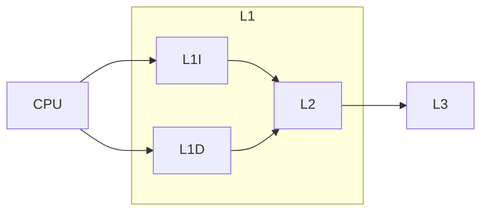

  

# 캐시 메모리, CPU와 메모리의 다리
^cache-def

[[03-cpu|CPU]]는 프로그램을 사용하기 위해서 [[04-memory|메모리]]에 빈번하게 접근해야 한다. 하지만 CPU가 메모리에 접근하는 속도는 레지스터에 접근하는 속도보다 느리기에 메모리에 접근하는 속도가 느리면 CPU가 아무리 좋더라도 소용이 없다. 그렇다면 속도를 어떻게 더 빠르게 할 수 있을까?

이를 해결하기 위해 **캐시 메모리**가 등장한다. CPU의 연산 속도와 메모리 접근 속도의 차이를 줄이는 것에는 캐시 메모리가 최고다. 아까 RAM의 종류에서 언급한 [[04-memory#^416fdb|SRAM]] 기반의 저장장치이다. CPU가 메모리에 직접 접근하게 하지 않고, 메모리에서 CPU가 사용할 일부 데이터를 RAM에서 미리 캐시 메모리에 복사해두고 활용하는 방식을 의미한다. 

## 캐시 메모리 구성

컴퓨터에는 여러 캐시 메모리들이 있다. CPU의 [[03.5-cpu-upgrade#^43fa62|코어]]를 기준으로 **L1, L2, L3**가 있다. 일반적으로 코어 내에는 L1, L2가 있고, L3은 캐시 메모리의 외부에 있다. 당연히 크기는 L3가 크지만, 속도는 L1이 제일 빠르다. 코어에서 가장 가까우니까 작지만 빠르다는 것이다. 여기서 가장 작고 빠른 L1은 처리 효율성을 높이기 위해 명령어 저장만 하는 **L1I**와 데이터만 저장하는 **L1D**로 나뉜다. 이러한 캐시 메모리가 있다면 **분리형 캐시**라고 한다.

이는 곧 CPU가 캐시 메모리를 활용하는 방식에서 보여진다. CPU는 데이터가 필요하게 되면 우선적으로 **L1**에서 데이터가 있는지 찾는다. 없으면 L2, 그리고 L3에서 검색한다. 하지만, 캐시 메모리의 용량은 일반적인 메모리 용량보다 훨씬 적다. 따라서 모든 내용을 캐시 메모리에 저장할 수 없다. 

캐시 메모리도 메모리의 일부를 저장한다. 그 중 **보조 저장 장치가 보관할 것** 과 메모리가 **실행 중인 것**을 저장하여 CPU가 사용할 법한 것을 저장한다. 맞다. CPU가 쓸 것 들을 **예측**해서 저장한다는 의미이다.

예측해서 저장한 것들이 CPU가 실제로 사용되는 경우에는 예측에 성공했다는 의미로, **캐시 히트** 라고 하며 실패해서 CPU가 메모리에 직접 가져와야 하는 상황이라면 **캐시 미스**라고 한다. AI를 해봐서 알겠지만, 이는 확률에 기반한다. 정확도가 높으면 높을 수록 성능이 좋은 모델처럼, 캐시 메모리도 예측을 잘 한다면, 그 만큼 성능이 좋다고 볼 수 있다. 따라서 캐시 메모리가 예측에 성공할 확률은 **캐시 적중률** 이라고 한다. 이게 낮다면 캐시 메모리의 이점을 활용할 수 없게 되고 CPU의 성능은 계속 하락하는 것이다.

## 이점은 참조 지역성의 원리로 

그렇다면 [[04.2-improve-cache-hit-rate|캐시 적중률을 어떻게 향상]]시킬 수 있을까. 이는 **참조 지역성의 원리**라는 원칙에 따랐을 때 이점을 최대한 활용할 수 있다. 참조 지역성의 원리는 시간 지역성과 공간 지역성으로 나누어서 볼 수 있다.
^improve-cachehitrate

| 참조 지역성의 원리 |                                    |
| ---------- | ---------------------------------- |
| 시간 지역성     | CPU는 최근에 접근했던 메모리 공간에 접근하는 경향이 있다  |
| 공간 지역성     | CPU는 접근했던 공간 근처의 공간에 접근하려는 경향이 있다. |

마치 사람과 비슷하다. 최근에 했던 것을 반복하는 습관과 같은 것이 시간 지역성이다. 이는 프로그래밍 언어에서 자주 보이는데, **변수** 설정이 이와 비슷하다. 우리는 프로그래밍을 할 때 변수를 저장해두고 사용한다. 이 변수는 한 번만 사용하는 것이 아니라 여러 번 사용하기 때문에 시간 지역성이라고 볼 수 있다.

이와는 달리 공간 지역성은 **Array, 배열**이 그렇다. 메모리는 스택의 자료 구조에 따라 저장된다고 배웠다. 그렇다면 2차원 배열에서 데이터를 추출할 때, 순차적으로, 행 단위로 추출하는 것이 빠르지 열 단위로 추출한다면 상대적으로 느려진다. 이것이 바로 공간 지역성이다. 공간 지역성을 고려한다면 행 단위로 추출하는 것이고 고려하지 않는다면 열 단위로 추출하는 것이다.

## 캐시 메모리에서 데이터 추출 방법

CPU는 캐시 메모리에서 데이터를 쓸 때 캐시 메모리에 새롭게 쓰여진 데이터와 메모리 상의 데이터가 일관성을 유지해야 한다. 가령 CPU가 메모리내 데이터를 변경하려고 한다고 가정했을 때, 메모리의 데이터를 직접 변경한다면 캐시 메모리와 일치하지 않기 때문에 결과가 다를 가능성이 높다. 이를 방지하기 위해 메모리는 2가지 방식을 가지고 있다. 

첫 번째는 **즉시 쓰기**이다. 캐시 메모리와 메모리에 동시에 적용하는 것이다. 일관성을 유지하는 것이 가장 중요하기 때문에 메모리를 항상 최신 상태로 유지한다. 하지만 이는 데이터를 쓸 때 마다 메모리를 참고해야 하기 때문에 버스 사용 시간과 쓰기 시간이 늘어날 수 밖에 없다. 메모리 접근을 최소화하기 위해 캐시 메모리를 사용하고 있는데, 비효율적으로 사용하는 것과 마찬가지이기 때문이다.

두 번째는 **지연 쓰기**이다. 캐시 메모리에만 써두고 이후 수정된 데이터를 메모리에 반영하는 것이다. 메모리에 접근 횟수를 줄이기 때문에 속도는 빠르지만, 메모리와 캐시 메모리 사이 일관성이 깨질 수 있다는 단점을 감수해야 한다. 지연 쓰기는 지금 이 상황에서도 많이 발생한다. 특히 현재 이 Blog를 작성할 때도 네트워크 캐시 메모리와 현재 로컬 메모리와의 차이로 인해서 반영이 느리거나 되지 않는 경우가 많다 (일관성 깨짐). 

캐시 메모리를 사용하면서 생기는 문제는 앞서 말했드시 로컬 뿐 아니라 네트워크 상황에서도 이루어지는 것이다. 하지만 **"자주 사용할 법한 대상을 가깝게 위치해서, 성능 향상을 이끌어낸다"** 의 이론은 동일하다는 것.
   
# 참고자료

※ 이 글은 [『이것이 컴퓨터 과학이다』](https://product.kyobobook.co.kr/detail/S000214014967) 책을 기반으로, 다양한 자료를 참고해 작성했습니다.