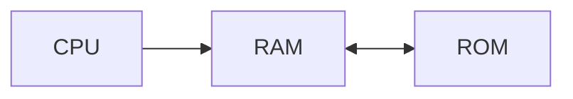

  

# 보조 기억 장치

우리는 기본적으로 메모리, RAM을 사용한다. 하지만 RAM은 휘발성이 강해 매 부팅마다 초기화되기 때문에 매번 컴퓨터를 사용할 때 마다 동일한 데이터와 명령어를 저장하기에는 너무 번거롭다. 그래서 사라지지 않는, **비휘발성**의 메모리인 보조 기억 장치를 사용한다. 전원이 꺼져도 기록할 수 있는 저장장치이기 때문이다. 

보조 기억 장치는 하드 디스크, SSD 등이 이에 해당한다. 메모리는 **실행 중인 프로그램**을 저장한다면, **보관할 프로그램** 자체를 저장하는 것이 보조 기억 장치다. 즉, 보조 기억 장치에 저장되어 있는 프로그램을 RAM에 복사하여 CPU가 사용하는 것이다.

| 종류          |             |                      |
| ----------- | ----------- | -------------------- |
| HDD         | 하드 디스크 드라이브 | 동그란 원판에 기록하여 데이터에 접근 |
| Flash Drive | 플래시 메모리     | 전기적 방식, USB, SSD 등   |

보조 기억 장치는 크게 2가지로 나눌 수 있다. **하드 디스크 드라이브 (HDD)** 와 **플래시 메모리 기반 저장장치**이다. 그 중 보조 기억 장치로서 주로 사용되는 것이 **SSD, Solid State Drive**이다. 

보조 기억 장치에 가장 중요한 역할은 **"전원이 꺼져도 저장을 하고, CPU가 필요로 하는 데이터를 보다 빨리 전달한다"** 이다. 즉, 보조 기억 장치의 데이터를 안전하고 안정적으로 빠르게 다를 수 있는 기술이 필요한데, RAID방식으로 해결할 수 있다.
# RAID의 방식으로 보다 안전하게

**RAID**는 Redundant Array of Independent Disks로 데이터 안전성 혹은 성능을 확보하기 위해 여러 개의 독립적인 보조 기억 장치를 활용해 **하나의 보조 기억 장치**로서 사용 하는 기술이다. 즉, 군단과 같이 여러 개를 모아서 하나로 움직이는 것이다. RAID를 구성하는 방식에는 **RAID LEVEL**이라고 표현한다. 이 중 **RAID0, RAID1, RAID4, RAID5, RAID6**이 가장 많이 사용된다.

## RAID0

데이터를 여러 보조 기억 장치에 **단순하게 나누어 저장하는 방식**을 의미한다. 하나의 데이터를 여러 디스크에 분산해서 저장하는 방식이다. 가장 Low Level으로 "0" 레벨이다. 각각 분산되어 저장되어 있고, 이를 그림으로 보면 줄무늬와 같다고 하여 **strip**, 이를 행하는 것이 **striping** 이라고 부른다.  

가장 단순하게 나누어 저장한 만큼, 데이터 입출력 속도가 가장 빠르다는 장점을 갖는다. 데이터를 한 번에 동시에 입출력이 가능하기 때문이다. 하지만 단점도 단순하게 분산 되어 있는 만큼, 하나의 디스크에 오류가 생긴다면 데이터가 불완전하게 되어 **저장된 정보가 안전하지 않을 수 있다**는 것이다. 즉, High risk, High return 이다.

## RAID1

조금 더 업그레이드를 해보자. 이제는 **완전한 복사본**을 만들어 저장하는 구성 방식이다. 단순하지만 복사하는 방식을 거치기 때문에 "1" 레벨이다. 거울처럼 동일한 객체가 저장되어 있기 때문에 **Mirroring**이라고 한다.

동일한 객체가 복사 되어 있는 만큼, 복구가 가장 간단하고 안전성이 높다는 장점이 있다. 마찬가지로 장점으로 인한 단점도 존재하는데, 같은 디스크를 복제해야 하기 때문에 쓰기 속도가 느리고 사용 가능한 용량이 적어진다는 것이다.

## RAID4

RAID0, 1과 다르게 RAID4는 **패리티 정보를 저장하는 디스크를 따로 두는 구성**방식을 의미한다. **패리티, Parity**정보란 오류를 검출할 수 있는 정보를 의미한다. 즉, 오류 정보를 검출하는 장치가 있어 RAID1에 비해서 적은 디스크로도 안전하게 데이터를 보관할 수 있는 특징을 갖는다. 
 ^parity-def
 
하지만 RAID4도 단점이 있는데, 패리티 정보를 저장하는 장치에 **병목 현상**이 발생한다는 것이다. 하드 디스크 1~3에 저장될 때 마다 하드 디스크 4에 패리티 정보를 저장해야 하는데, 하드 디스크 4에 저장에 지연이 생기면 계속해서 느려지는 것이기 때문이다.

## RAID5

그래서 RAID5가 나온다. RAID4의 **패리티 정보를 분산해서 저장하는 구성방식**이다. 그렇다면 병목 현상을 보안할 수 있기 때문이다. 각각의 디스크에 패리티 정보를 포함해서 저장하기 때문에 안전하고 쉽게 저장할 수 있다.

## RAID6

RAID5와 동일하지만, 한 방식을 추가해서 LEVEL "6"을 얻었다. **서로 다른 2개의 패리티 정보를 두는 구성 방식**을 의미한다. 즉, **오류를 검출하는 수단과 복구하는 수단이 2개**가 있어 안전성이 높다. 다만, 새로운 정보를 저장할 때 마다 패리티 정보 또한 2개로 늘어나기 때문에 RAID5보다는 느리다.

## Nested RAID

RAID LEVEL 단위로만 사용하지 않는다. RAID5와  RAID0의 방식을 혼합해 RAID50 Level도 있으며 RAID1과 RAID0을 혼합해 RAID10 Level이 존재한다.

# 결론

결국 정리하면, RAID의 레벨이 낮을 수록 단순하지만 불완전하고, 높아질 수록 복잡하지만 안정적인 특징을 갖는다. 그렇다고 RAID가 낮다고 사용하지 않는 것이 아니라 여러가지를 조합해서 사용하니 각 환경에 맞게 사용하는 것이 좋을 것 같다.

   
# 참고자료

※ 이 글은 [『이것이 컴퓨터 과학이다』](https://product.kyobobook.co.kr/detail/S000214014967) 책을 기반으로, 다양한 자료를 참고해 작성했습니다.