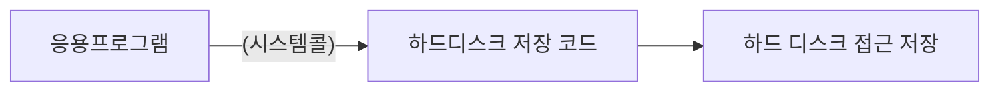

  

# 시스템 콜과 이중 모드

[[8-os|운영체제]]도 일종의 프로그램이기 때문에 프로그램이 실행되기 위해서는 반드시 [[4-memory|메모리]]에 적재되어야 한다. 다만, 사용자 프로그램과는 달리 운영체제는 매우 특별한 프로그램이기에 메모리 내에 **커널 영역**이라는 공간에 따로 적재하여 실행한다. 이렇게 운영체제가 적재되는 커널 영역 외에 사용자 응용 프로그램이 적재되는 공간을 **사용자 영역**이라고 한다. 여기서 **운영 체제의 기능을 제공 받기 위해서는 커널 영역에 적재된 운영체제 코드를 실행**해야 한다는 것이다.

일반적으로 웹 브라우저나 게임과 같은 응용 프로그램은 운영체제와 달리 [[3-cpu|CPU]] , 메모리와 같은 자원에 직접 접근하거나 조작할 수 없다. 특정 자원에 접근하거나 조작하는 운영 체제 코드를 직접 실행해야 하기 때문이다. 즉, 운영체제가 자신의 코드를 실행한 응용 프로그램의 자원 접근 및 조작을 대행해야 하는 것이다.

그렇다면, 응용 프로그램은 어떻게 운영체제의 코드를 실행할 수 있을까? 응용 프로그램은 **시스템 콜**을 호출하여 운영 체제 코드를 실행할 수 있다. **"시스템 콜"** 은 운영체제의 서비스를 제공 받기 위한 수단, 호출 가능한 함수 형태를 가지는 인터페이스다. 응용 프로그램이 직접적으로 하드웨어에 접근하지 않고, 시스템 콜을 호출하여 운영체제와 연결, 하드웨어에 호출하는 형식이다.

## 시스템 콜의 종류

시스템 콜은 운영 체제에 따라 다양하게 분포되어 있다. 응용 프로그램은 프로세스 관리, 파일관리, 디렉터리 관리, 파일 시스템 관리 등의 시스템 콜을 호출하여 운영체제의 기능을 제공 받는다.

## 시스템 콜 작업 수행

컴퓨터 내부에서 시스템 콜이 호출되면, 소프트웨어 인터럽트, 커널 모드, 사용자 모드 순서로 작업이 수행된다. 

운영체제에는 인터럽트를 발생시키는 [[3-cpu#^interrupt-def|인터럽트]]의 특정 명령어가 존재한다. 자원에 접근하는 입출력 명령어가 대표적으로 있으며, 이러한 명령어에 의해 발생하는 인터럽트를 **소프트웨어 인터럽트** 라고 한다.

시스템 콜이 이 **소프트웨어 인터럽트**의 일종이다. 사용자 영역을 실행하는 과정에서 시스템 콜이 호출되면, CPU는 인터럽트와 동일하게 작업을 백업하고, 커널 영역 내 인터럽트를 처리하기 위한 코드를 실행 후, 다시 사용자 영역 코드 실행을 재개한다.

또 CPU는 명령어를 실행하는 과정에서 사용자 영역을 실행할 때의 모드와 커널 영역을 실행할 때의 모드를 구분해서 실행한다. 사용자 영역에 적재된 코드를 실행할 때 실행 모드를 **사용자 모드**, 커널 영역에 적재된 코드를 실행할 때 **커널 모드**. 이 두개의 모드로 구분하여 실행하는 것을 **이중 모드**라고 한다. 어떤 모드가 실행되는지를 확인 하기 위해서는 [[3-cpu#^flag-register-def|플래그 레지스터]] 중 **슈퍼바이저 플래그**를 통해 확인할 수 있다.

사용자 모드는 운영체제 서비스를 제공 받을 수 없는 실행 모드이다. CPU는 입출력 명령어와 같이 자원에 접근하는 명령어를 만나도 이를 실행하지 않는다. 이를 통해 사용자 모드로 실행되는 모든 명령어는 실수라도 자원에 접근할 수 없다.

반면 커널 모드는 운영체제 서비스를 제공 받을 수 있는 실행 모드이기에 CPU가 명령어를 실행하면 자원에 접근하는 명령어를 비롯한 모든 명령어를 실행할 수 있다. 

응용 프로그램은 실행 과정에서 시스템 콜을 빈번하게 호출한다. 소스 코드로 작성된 프로그램 뿐 아니라 ls와 같은 명령어 또한 프로그램으로 수 많은 시스템 콜을 호출하게 된다. 따라서 프로그램은 시스템 콜을 통해 사용자 모드와 커널 모드를 빈번하게 오가며 운영 체제의 소스 코드를 실행하게 된다.

   
# 참고자료
※ 이 글은 [『이것이 컴퓨터 과학이다』](https://product.kyobobook.co.kr/detail/S000214014967) 책을 기반으로, 다양한 자료를 참고해 작성했습니다.