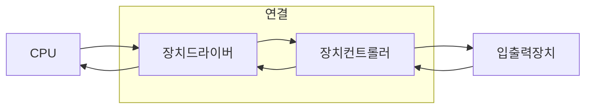

  

# 입출력 장치

우리는 컴퓨터를 [[03-cpu|CPU]], [[04-memory|메모리]]만 놓고 사용하지 않는다. 모니터로 화면도 보아야 하고, 마우스와 키보드로 입력을, 스피커로 소리를 듣고, [[07-GPU|GPU]]나 여러 기기들을 활용해서 컴퓨터를 사용한다. 또한 [[05-secondary-storage|보조 기억 장치]]를 사용함으로써 더욱더 편리하고 많은 데이터를 저장하기도 한다. 

보조 기억 장치와 입출력 장치는 그렇게 다른 개념은 아니다. 보조 기억 장치는 메모리를 보조하는 업무를 수행하는 것이며, 입출력 장치는 컴퓨터 내부와 정보를 교환하는 장치라고 보면 된다.  이 장치들이 어떻게 컴퓨터 내부와 정보를 주고 받는지, 입출력 기법에 대해서 알아보자.

## 장치 컨트롤러와 장치 드라이버

키보드, 마우스, 모니터, 하드 디스크 등 다양한 입출력 장치들이 있다. 하지만 같은 입출력 장치라고 작동 방식은 각기 다르다. CPU 입장에서는 이 모든 것들을 이해하고 활용하기에는 부담스럽다. 그렇기 때문에 **장치 컨트롤러** 라는 하드웨어를 통해 연결된다. 모든 입출력 장치는 각각의 장치 컨트롤러를 통해 컴퓨터와 통신한다. 장치 컨트롤러는 하드웨어로서 각 기기에 설치되어 있다. 컨트롤러는 RAM으로 이루어져 있기 때문에 중간 값들이 저장된다. 이 말은 즉, **휘발성**인 경우가 많아 입출력 작업 도중 연결이 해제되거나 안전 제거를 하지 않는다면 입출력 데이터에 오류를 발생할 수 있다.

CPU는 결국 프로그램을 실행하기 위해 존재한다. 아무리 장치 컨트롤러가 CPU랑 연동이 된다고 한 들, 프로그램이 없이는 CPU가 작동하지 않는다는 뜻이다. 이 때 **장치 드라이버**라는 프로그램이 CPU에게 프로그램을 실행하게 한다. 장치 드라이버는 장치 컨트롤러의 동작을 이해하고, 컴퓨터 내부와 정보를 주고 받게 하는 역할을 한다. 이 말은 곧 컴퓨터가 장치 드라이버를 인식하지 못한다면 입출력 장치는 입출력 장치를 하지 못하고 컴퓨터의 전력만 훔치는 탕자가 되어버린다.

CPU는 장치 컨트롤러와 장치 드라이버로서 입출력 장치를 실행한다. 그렇다면 CPU가 장치 컨트롤러와 정보를 주고 받는 방식, 입출력 작업을 수행하는 방법이 어떻게 있을까? 이는 프로그램 입출력, 인터럽트 기반 입출력, DMA 입출력으로 나눌 수 있다.

### 프로그램 입출력

프로그램 입출력은 프로그램 속 입출력 작업을 수행한다는 단순한 방식이다. CPU는 입출력 장치에게 **입출력 명령어**를 실행함으로써 장치 컨트롤러와 상호작용을 통해 입출력 작업을 수행한다. 프로그램 입출력 방식은 [[02-readable-data#^address-def|오퍼랜드]], 즉, 입출력 장치의 주소를 식별하는 방식에 따라 **고정형 입출력**과 **메모리 맵 입출력**으로 나눈다.

1. 고정형 입출력  
   입출력 장치에 접근하는 주소와 메모리에 접근하는 주소를 따로 간주하는데, 입출력 장치 만을 위한 주소 공간에 접근하기 위해 **명령어**가 필요하다.
2. 메모리 맵 입출력  
   주소 공간과 메모리에 접근하는 주소를 고려하지 않고, 메모리에 부여된 주소 공간의 **일부**를 입출력 장치가 식별하게 유지하는 방법이다. 즉, 메모리 접근 명령어도 입출력까지 가능함.

### 인터럽트 입출력

[[03.4-interrupt|CPU의 인터럽트]]에서 본 하드웨어 인터럽트의 일반적인 상황인 **다중 인터럽트 처리**가 있다. 우리는 컴퓨터를 사용할 때 키보드만 사용하거나 모니터만 사용하지 않는다. 지금 나조차 이 글을 작성할 때 컴퓨터와 연결되어 입출력이 되는 장비는 모니터 2대, 키보드, 마우스, 스피커가 연결되어 있고 모두 작업을 실행하고 있다. 이러한 경우 어떻게 처리하는 것일까

인터럽트는 항상 순차적으로 처리되지 않고, 우선 순위에 따라 처리 되는 경우가 많다. 인터럽트 A와 인터럽트 B가 순차적으로 발생하였다고 가정해보자. CPU는 인터럽트 A를 처리하던 중 인터럽트 B가 들어왔는데, 인터럽트 B가 A보다 우선순위가 높다면 A를 처리하다가 B를 처리하고 다시 인터럽트 A 처리를 재개 후 기존 작업을 처리한다.  

CPU는 [[03.3-register#^flag-register-def|플래그 레지스터]] 속 인터럽트 비트가 활성화 되어 있거나 인터럽트 비트를 비활성화해도 무시할 수 없는 인터럽트, **NMI (Non-Maskable Interrupt)** 가 발생한 경우 우선 순위가 높은 인터럽트부터 먼저 처리하게 된다. ^NMI-def

다중 인터럽트를 처리하기 위해서는 **PIC, (Programmable Interrupt Controller)** 라는 하드웨어가 사용된다. PIC는 여러 장치 컨트롤러에 연결되어 있어서 하드웨어 인터럽트 요청들의 우선순위를 판별한다. 그리고 CPU에게 지금 처리해야 할 인터럽트가 무엇인지 알려주는 장치이다. 대신 PIC는 NMI까지 판별하지 않는다. 왜냐하면 무시하면 안되니까. 가장 우선 시 되는 인터럽트니까.

일반적으로 PIC는 여러 개 이상의 계층으로 구성한다. 이를 통해 CPU가 다중 인터럽트를 원활하게 처리할 수 있기 때문이다.

### DMA 입출력

위 두 방식 (프로그램 입출력, 인터럽트 입출력) CPU가 입출력 장치와 메모리 간의 데이터 이동을 주도해야 하며, 이동하는 데이터들도 반드시 CPU를 거친다. 입출력 장치의 데이터를 메모리에 저장한다면, CPU 는 장치 컨트롤러로부터 데이터를 읽어 레지스터에 적재하고, 해당 데이터를 하나 씩 메모리에 저장한다. 출력도 마찬가지로 메모리 -> 레지스터 -> 장치 순으로 일어난다.

이처럼 입출력 장치와 메모리 사이에 전송되는 모든 데이터가 반드시 CPU를 거친다면 CPU는 터져버릴 것이다. 그래서 입출력 장치와 메모리가 상호 작용할 수 있게 하는  **DMA, Direct Memory Access** 입출력 방식이다. 인간으로 따지면 척추 반사 같은 것이다. 뇌를 거치지 않고 바로 반응 할 수 있도록.

DMA 입출력 방식을 위해서는 시스템 버스에 연결된 DMA 컨트롤러라는 하드웨어가 필요하다. DMA 컨트롤러는 시스템 버스에 연결되고 입출력 장치 컨트롤러는 **입출력 버스**라는 컨트롤러 전용 버스에 연결된다. 이를 순차적으로 보면

1. CPU가 DMA 컨트롤러에게 입출력 장치의 주소, 수행할 연산, 메모리 주소 등의 정보와 함께 명령한다.
2. DMA컨트롤러가 CPU대신 장치 컨트롤러와 상호작용해 입출력 작업을 수행한다. 필요할 경우 DMA 컨트롤러가 메모리에 직접 접근해 정보를 읽거나 사용한다. (데이터가 CPU를 거치지 않음)
3. DMA 컨트롤러는 입출력이 끝나면 CPU에게 인터럽트를 걸어 작업 수행 종료를 알린다.

> [!info] cycle stealing
> 시스템 버스는 공용 자산이다. CPU와 DMA 컨트롤러가 동시에 시스템 버스를 사용할 수 없기 때문에 둘 중 하나만 사용하게 된다. 기본적으로 시스템 버스는 CPU가 우선적으로 사용하게 되는데 DMA 컨트롤러가 시스템 버스를 훔쳐가며 쓰는 형식을 보이기 때문에 사이클 스틸링 이라는 단어가 붙었다.

### 입출력 버스

사용되는 입출력 버스는 **PCIe, Peripheral Component Interconnect express**가 있다. 가장 대중적으로 사용되고 있는 입출력 버스이다. PCIe 버전에 따라 입출력 장치의 성능이 달라진다. 버전에 따라 지원되는 최대 속도가 다르다. 또한 PCIe 버스를 통해 정보를 송/수신하는 단위, **Lane**이 존재한다.  Lane이 많을 수록 동시에 통신을 주고 받을 수 있는 양이 많아지기 때문에 속도가 빨라진다.

   
# 참고자료

※ 이 글은 [『이것이 컴퓨터 과학이다』](https://product.kyobobook.co.kr/detail/S000214014967) 책을 기반으로, 다양한 자료를 참고해 작성했습니다.