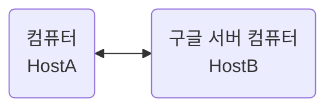
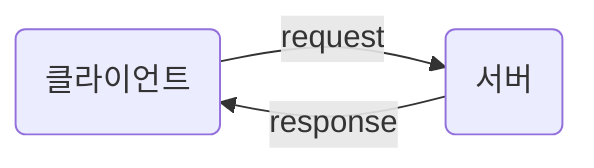
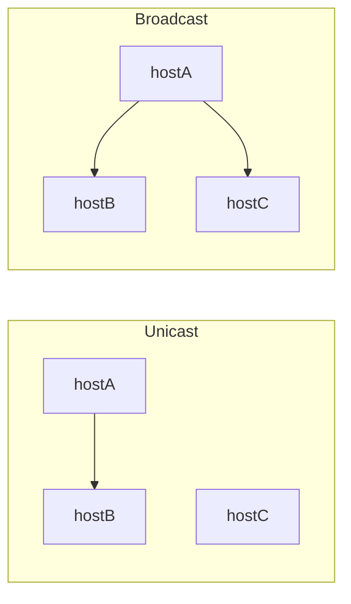

  

# 네트워크의 배경 지식

모든 학문이 그렇듯, 어느 정도의 배경 지식이 있는 것이 앞으로의 학습에 도움이 된다. 특히 네트워크에 관련해서는 지금까지 배웠던 CS 보다 용어가 어려운 경우가 많았다. 따라서 네트워크에 대한 배경 지식을 숙지하고 다음으로 넘어가려고 한다.

## 기본 구조

네트워크(Network)는 말 그대로 그물 형태를 보인다. 각 기기와 기기가 정보를 주고 받는 통신망을 의미하기에 이러한 형태를 보이는 것이다. 앞선 자료구조의 그래프와 마찬가지로 기기(노드)와 통신 매체(간선)으로 이루어져 있다.

네트워크 상에서 노드와 노드 사이의 연결 구조는 **네트워크 토폴로지 Network Topology** 라고 부른다. Topology(위상 수학)으로서 노드(기기)가 어떻게 연결되고 배치되느냐에 따라 유형이 달라진다.

## Host

네트워크의 가장자리에 위치하면서 네트워크를 통해 주고 받는 정보를 "최초"로 송신하고 "최종"으로 수신받는 노드(기기)를 **"호스트"** 라고 부른다. 지금 내가 사용하고 있는 컴퓨터, 핸드폰 등등이 모두 호스트다.  

기본적으로 호스트 기기끼리 연결을 하지만, 최초 송신을 요청하고, 다시 수신하는 방향과 흐름이 존재한다. 위 예제를 예로 들면 컴퓨터 HostA가 구글 서버 컴퓨터 HostB에게 어떠한 정보를 요청하면 HostB는 HostA에게 그 정보를 응답한다. 

즉, 정보를 **요청**하는 호스트를 우리는 **클라이언트 Client**, **응답**을 송신하는 호스트를 우리는 **서버 Server** 라고 한다. 레스토랑에서 고객이 서버에게 메뉴를 요청하고 메뉴를 서버에게 전달 받는 것 처럼 말이다.

우리는 클라이언트이고 서버와 데이터를 주고 받는데 있어서 직렬로 통신하지 않는다. 컴퓨터가 서버에 연결되는 것이 아니기 때문이다. 따라서 컴퓨터가 요청하는 정보를 안정적으로 전송하는 노드들이 있다. 그게 바로 스위치, 라우터, 공유기 등을 의미한다.

## LAN & WAN

네트워크는 그래프의 형태를 띄고 있지만 단 하나의 그래프로 이루어지지 않았다. 여러 네트워크로 나누고 연결하는 형식을 따르기 때문이다.

**LAN (Local Area Network)** 는 말 그대로 **근거리 네트워크**를 의미한다. 가정이나 기업처럼 비교적 가까운 곳을 연결하는 네트워크를 의미한다. 컴퓨터를 구매하거나 인터넷을 가정이나 회사에서 사용할 때 "LAN 선"을 연결하라는 말을 들어봤을 건데, 이게 그 LAN이다.

LAN으로 연결된 공유기와 연결되었으면 모두 같은 LAN상에 있음을 의미한다. 하지만 LAN은 그 지역만 사용하는 것이 아니라 여러 외부 LAN과도 통신을 한다. 

**WAN (Wide Area Network)** 또한 말 그대로 **원거리 네트워크**를 의미한다. LAN 간의 통신을 이루어지게 하며 인터넷을 가능하게 만들어주는 구조를 의미한다. WAN은 일방적으로 IISP(Internet Service Provider)라는 인터넷 서비스 업체가 구축하고 관리하는데, KT, SKT등이 여기에 해당한다.

## 패킷 교환 네트워크

두 호스트가 유/무선 통신 매체를 활용해 `500GB` 파일을 주고 받는다고 가정해보자. 만약 이 파일을 요청하고 응답할 때, `500GB`의 파일을 한 번에 전송한다면 우리의 인터넷 요금은 상상을 초월할 것이고 다운로드 받는 시간까지 포함하면 엄청난 시간이 걸릴 것이다.

따라서 네트워크는 호스트간 송신 할 때 데이터를 쪼개서 송신한다. **패킷, Packet** 은 묶음, 다발을 의미하는데 쉽게는 포장 박스라고 생각하면 편하다.

하나의 패킷에는 **페이로드 (payload)**, **헤더 (Header)** 로 이루어져 있으며 간혹 **트레일러(Trailer)** 라는 정보를 포함하기도 한다.

- 페이로드: 보내야 할 데이터 (포장 박스 내 물건)
- 헤더: 부가 정보 (송장)
- 트레일러: 부가 정보 (송장 내 물품 설명)

## 주소의 개념과 전송 방식

패킷을 주고 받기 위한 송장에는 서로를 알아야 하는 정보가 포함해야 한다. 우리의 택배의 송장처럼 **주소**가 필요하다. 주소는 패킷의 헤더에 명시되는 정보이고, **IP주소와 MAC주소**가 있다

송신지와 수신지가 1:1로 메시지를 주고 받는다면 **유니캐스트**, 네트워크 내 모든 호스트에게 메시지를 전송한다면 **브로드 캐스트**이다.

브로드 캐스트가 전송되는 범위는 **브로드 캐스트 도메인**이라고 하며, 호스트가 같은 도메인에 속해 있다면 같은 LAN에 속해 있다고 한다.

### 프로토콜

서로의 주소를 알고 있는 두 호스트가 패킷을 주고 받는 상황일 경우, 두 호스트와 네트워크 장비들은 모두 패킷의 정보를 이해할 수 있어야 한다. 이를 위한 규칙이 프로토콜이다.

네트워크에서 통신을 주고받는 노드 간의 합의된 규칙이나 방법을 의미한다. 호스트와 네트워크 장비들을 모드 같은 프로토콜로 통신해야 한다.

프로토콜의 종류는 다양하지만 IP, ARP, TCP, UDP, HTTP 등 많다

프로토콜은 목적과 특징이 다르다.
- IP: 네트워크 간의 주소를 지정한다는 목적
- ARP: IP주소와 MAC 주소를 대응시킨다는 목적
- HTTPS: 보안상 HTTP보다 안전
- TCP: UDP보다 신뢰성이 높음

## 네트워크 참조 모델

통신이 이루어지는 단계를 의미함. 패킷을 송신하는 쪽에서 상위 계층에서 하위 계층으로 정보를 보내고, 패킷을 수신하는 쪽에서 하위 계층에서 상위 계층으로 정보를 받아드린다.

### OSI 모델

국제 표준화 기구에서 만든 네트워크 참조 모델. 통신 단계를 7개 계층으로 나눔
- 물리, 데이터 링크, 네트워크, 전송, 세션, 표현, 응용
- 이론적 기술을 목적으로 만듬

## TCP/IP 모델

구현과 프로토콜에 중점한 네트워크 참조 모델

## 캡슐 & 역캡슐화

   
# 참고자료
※ 이 글은 [『이것이 컴퓨터 과학이다』](https://product.kyobobook.co.kr/detail/S000214014967) 책을 기반으로, 다양한 자료를 참고해 작성했습니다.