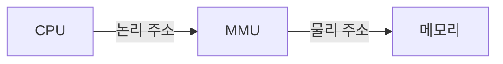
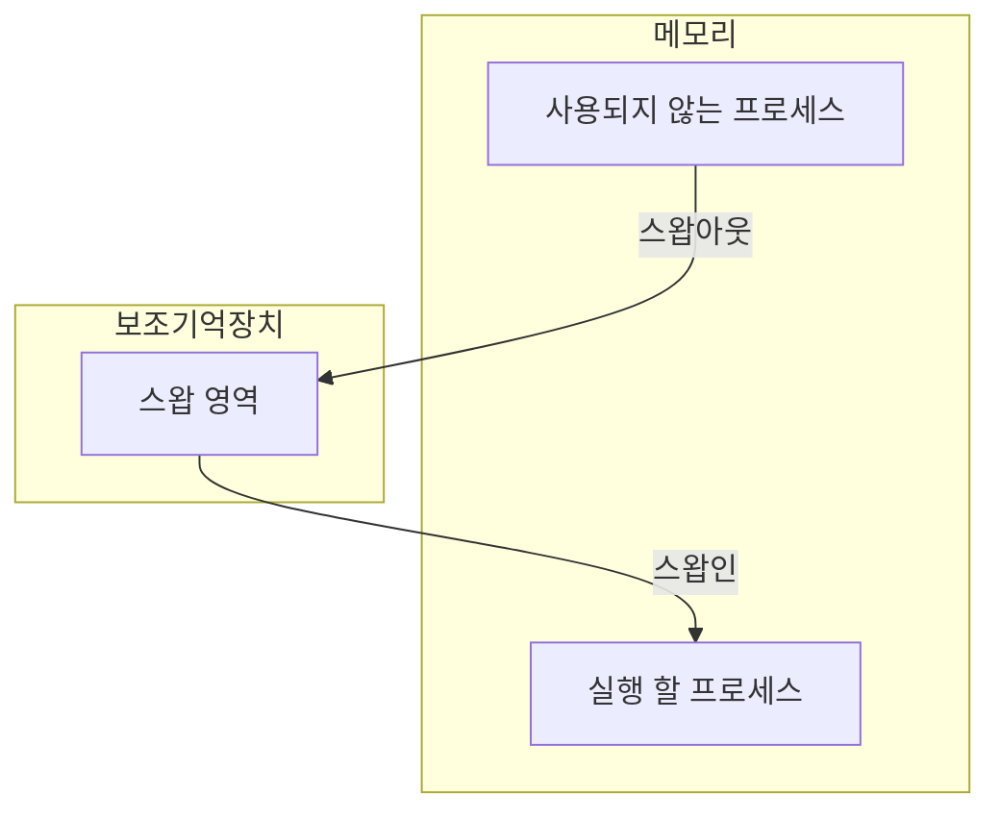
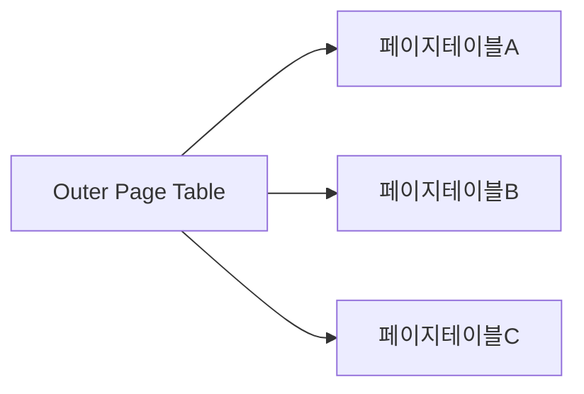
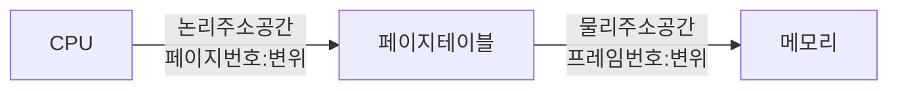

<p align="center">
  
</p>

# 가상 메모리 존재 이유

[[03-cpu|CPU]]와 [[09-process-n-thread|프로세스]]는 [[04-memory|메모리]] 주소 어디에 저장되어 있는 것 까지 저장하지 않는다. 이걸 저장하려면 CPU 내부의 저장 공간인 [[03.3-register|레지스터]]가 메모리만큼 커야 하는데, 물리적으로도 작고 용량도 작아 구현하기 어렵다. 또한 새로운 프로세스는 계속해서 메모리에 적재되고, 사용하지 않는 것들은 메모리에서 삭제된다. 즉, 메모리 정보는 지속적으로 변경이 일어난다. 이러한 변동성을 해결해야 CPU가 메모리에 적재된 프로세스의 주소를 인식하고 관리할 수 있다.

### 물리 주소와 논리 주소

^635d39

CPU와 프로세스는 메모리의 하드웨어 상 실제 주소인 **물리 주소**가 아닌 **논리 주소**를 이용한다. 프로세스마다 부여하는 0번지부터 시작하는 주소 체계가 **논리 주소**이다. 

이처럼, 물리 주소는 중복되는 번지 수는 존재 하지 않는다. 메모리 상에 저장되어 있으며, 유일해야 하기 때문이다. 하지만 프로세스의 경우, 논리 주소로 저장되며, 이는 동일하게 0번지부터 존재하기 때문에 중복되는 경우가 다소 존재한다.  ^d8f7bb

CPU와 프로세스가 사용하는 주소 체계는 논리 주소이다. 따라서 CPU가 이를 이해하기 위해서는 Adapter인 **메모리 관리 장치, Memory Management Unit (MMU)** 를 통해 요청한 **논리 주소**를 **물리 주소**로 변환해야 이해할 수 있다.



### 스와핑

단어 그래도, 다른 무언가로 교체한다는 뜻이다. 대기 상태 등 오랫동안 사용되지 않는 프로세스가 있다면, 바꾸는 것이다.

기존에 있던 프로세스는 **스왑 영역(Swap Space)**, [[05-secondary-storage|보조 기억 장치]]의 일부 영역으로 옮겨진다. 이렇게 기존에 있던 프로세스가 스왑 영역으로 옮겨지는 것을, **스왑 아웃(Swap Out)** 이라고 한다. 반대로 스왑 영역에 있던 프로세스가 다시 메모리로 돌아오는 경우를 **스왑 인(Swap In)** 이라고 한다.

스왑 영역에 존재했던 프로세스가 다시 메모리로 **스왑 인**을 하게 되면, 기존에 똑같은 주소에 적재되지는 않는다. 이미 교체된 프로세스는 기존과 다른 **물리 주소**에 적재될 수 있다.



## 연속 메모리 할당과 문제

프로세스들은 메모리 내에 배치가 된다. 실질적으로 사용되지는 않지만 **연속적으로 배치되는 상황**을 가정하게 되면 프로세스들은 그 순차에 맞게 메모리를 할당 받는다. 이를 **연속 메모리 할당** 이라고 한다.

프로세스는 각기 다른 메모리 용량을 할당 받아 배치되는데, [[09-process-n-thread#^fc63aa|사용자 영역]]에는 코드, 데이터 등이 저장되기 때문에 프로세스들을 일렬로 빈칸 없이 배치하기에는 불가능한 상황이 생긴다. 가령, 아래의 그림과 같이 메모리 내 저장되었다고 가정해보자.

```markdown
+--------------------+
|     커널 영역       |
+--------------------+
|   프로세스 A (50MB) |
+--------------------+
|   미사용 (30MB)     |
+--------------------+
|   프로세스 C (100MB)|
+--------------------+
|   미사용 (20MB)     |
+--------------------+
|   총 메모리: 200MB  |
```

### 외부 단편화 문제

메모리 내 50MB는 빈 공간이라, 50MB의 프로세스를 적재할 수 있을 것으로 보이지만, 프로세스는 분할을 할 수 없기 때문에 메모리 50MB는 낭비하게 된다. 이러한 문제를 **외부 단편화**라고 한다.

> [!caution] 외부 단편화
> 프로세스 **실행과 종료** 혹은 **적재와 삭제**가 반복되며 발생된 메모리 사이의 빈 공간.
> 프로세스 바깥에 생긴 공간으로 인해 빈 공간보다 더 큰 프로세스를 적재하기 어려운 상황
> **"메모리 낭비"** 초래

### 물리 메모리보다 큰 프로세스

연속 메모리 할당으로 인한 문제는 또 다른 문제를 야기한다. 프로세스를 반드시 연속적으로 메모리에 할당한다고 가정할 때, 커널 영역을 포함한 메모리가 4GB, 프로세스가 4GB라고 하면 $프로세스 > 물리메모리$ 로 인해 적재할 수가 없다.

하지만 현대 프로그램은 이 보다 훨씬 큰 용량을 차지하고 있고 우리는 잘 사용하고 있다. 이를 해결하기 위한 방법이 바로 이 글의 주제인 **"가상 메모리 관리 기법**"이다.

# 가상 메모리 정의

가상 메모리란, 실행하고자 하는 프로그램의 **일부**만 메모리에 적재해서 **실제 메모리 보다 더 큰 프로세스**를 실행하는 메모리 관리 기법이다. 

쉽게 말해, 프로세스의 일부만 메모리에 적재해 메모리를 실제 크기보다 더 크게 보이게 하는 기술이다.

## 관리기법 1: 페이징

**페이징**은 [[#^635d39|논리 주소]] 공간을 페이지(Page)라는 일정한 단위로 나누고, [[#^d8f7bb|물리 주소]] 공간을 페이지와 동일한 크기의 프레임(Frame)이라는 일정한 단위로 나눈 뒤에, 페이지를 프레임에 할당하는 가상 메모리 관리 기법이다.

페이지는 물리 메모리 내에 연속적으로 배치를 하지 않아도 된다. 즉, 불연속적으로 배치될 수 있기 때문에 외부 단편화가 발생하지 않는다. 페이지와 프레임의 크기는 동일하고 일정하기 때문이다.

페이징 기법에서도 스와핑을 사용할 수 있다. 페이징을 사용하는 시스템에서는 프로세스 전체가 움직이는 것이 아닌, 페이지 단위로 스왑 인/아웃을 실행한다. (**페이지 인, 페이지 아웃**). 

프로세스를 실행하기 위해 전체가 메모리에 적재되는 것이 아니라 일부는 메모리, 일부는 보조 기억 저장 장치에 저장되어도 실행이 가능하다. 즉, CPU입장에서는 메모리가 프로세스보다 작아도 페이지 단위로 나누어서 프로세스 실행이 가능하다.

### 페이지 테이블

메모리에 불연속적으로 배치되어 있다는 것은 CPU가 다음으로 실행할 페이지의 위치를 찾기가 어렵다. 그렇기 때문에 해쉬 테이블과 비슷하게 **페이지 테이블**을 활용한다. 페이지 테이블에는 페이지 번호와 실제로 적재된 프레임 번호가 대응되어 있다. 프로세스마다 고유의 테이블 정보를 갖고 있으므로 CPU는 페이지 테이블을 참고하여 메모리에 접근한다.

페이지 테이블은 페이지 번호와 프레임 번호 및 여러 정보들을 포함한다. 이 정보들은 **테이블 엔트리**라고 한다. 운영체제마다 차이가 존재하지만, 페이지 번호, 프레임 번호, 유효 비트, 보호 비트, 참조 비트, 수정 비트가 있다.

**유효 비트**는 해당 페이지에 접근이 가능한지 여부를 알려준다. 현재 페이지가 메모리 아니면 보조 기억 장치에 적재되어 있는 지 알려준다.
- 페이지가 메모리에 적재되어 있음: `1`
- 페이지가 메모리에 적재되지 않음 (보조기억장치): `0`

만약 CPU가 메모리에 적재되지 않은 페이지 (유효비트 = 0)에 접근하다면,  
**페이지 폴트(page falut)** 라는 예외가 발생한다. ^74328d

> [!note] 페이지 폴트 종류
> 페이지 폴트에는 2가지 종류로 나뉜다. 이 둘은 보조 기억 장치와의 입출력 작업이 필요한  
> 페이지 폴트인가 아닌가로 나눈다.
> 
> **메이저 페이지 폴트**
> - 보조 기억 장치에서 CPU가 원하는 페이지를 읽어 들이기 위해 입출력 작업이 필요하다.
> 
> **마이너 페이지 폴트**
> - 보조 기억 장치와의 입출력이 필요하지 않은 페이지 폴트이다. CPU가 요청한 페이지가 물리 메모리에는 존재하지만, 페이지 테이블 상에는 반영되지 않은 경우 발생한다.
> 
> > [!warning] 폴트 처리 과정
> > 1. 기존 작업 백업
> > 2. 페이지 폴트 처리 루틴 실행
> > 	- 원하는 페이지를 메모리로 가져와 유효 비트를 1로 수정
> > 3. 메모리에 적재된 페이지 실행
> >	

**보호 비트**는 페이지 보호 기능을 담당한다. 페이지의 접근할 권한을 제한하여 페이지를 보호한다. 
- 읽기(`r`) , 쓰기(`w`), 실행(`x`)을 나타내는 조합으로 페이지 권한을 제한한다. 


**참조 비트**는 CPU가 해당 페이지에 접근한 적이 있는 지의 여부를 나타낸다. 
- 페이지에 적재한 이후에 CPU가 읽거나 쓴 페이지는 참조 비트가 1로 설정
- 적재한 이후에 한 번도 쓴 적이 없는 페이지는 0으로 유지된다.


**수정 비트**는 해당 페이지에 데이터를 쓴 적이 있는지 여부를 알려준다 (**더티 비트**).
- 한 번 이라도 1이면 변경된 페이지, 0이면 변경된 적이 없는 페이지
- 수정 비트가 1일 경우, 페이지를 메모리에서 삭제해야 할 때 페이지의 수정 내역을 **보조 기억 장치에도 반영**해 두어야 하므로 보조 기억 장치에 대한 쓰기 작업이 필요하다. 
- 반대로 수정한 적이 없다면 별도의 쓰기 작업이 없이 삭제한다.

### 문제: 내부 단편화

페이징은 외부 단편화 문제를 해결할 수 있다. 하지만 **내부 단편화**라는 문제를 야기한다. 

논리 주소 공간을 페이지라는 일정한 크기 단위로 나누지만 모든 프로세스가 알맞게 잘리지는 않는다. 즉, 모든 프로세스의 크기가 페이지의 배수가 아니라는 것이다. 수를 나누고 나머지가 생기는 것과 마찬가지로 조금씩 남아버리는 메모리의 문제가 바로 **내부 단편화**문제이다.

> [!summary] 외부 단편화 vs 내부 단편화
> 외부 단편화: 연속 할당으로 프로세스 외부에 조금씩 남아버리는 메모리 낭비
> 내부 단편화: 페이지 하나의 크기보다 작은 크기로 발생되는 메모리 낭비

### 문제: 페이지 테이블 크기

페이지와 프레임을 Key와 value처럼 저장하여 이정표 역할을 하는 페이지 테이블은 그 크기가 정해져 있지 않다. 한계가 없어 생각보다 크고, 프로세스의 크기가 커지면 자연스레 페이지 테이블 또한 크기가 커진다. 이렇게 커진 페이지 테이블을 메모리에 두면 메모리 낭비 또한 심해지고 효율적으로 사용할 수 없다.

#### 해결 방안: 계층적 페이징

페이지 테이블을 또 다시 페이징을 하는 방식이다. 프로세스의 페이지 테이블을 여러 개의 페이지로 자르고, CPU와 가까이 위치한 바깥 쪽에 페이지 테이블(Outer Page Table)을 하나 더 둔다. 그리고 잘린 페이지 테이블의 페이지 들을 가르키게 한다. 



계층적 구조를 보이기 때문에 **다단계 페이지 테이블 기법** 이라고 불린다. 이렇게 페이지 테이블을 나누어 저장하면, 모든 페이지 테이블을 항상 메모리에 유지하지 않아 메모리를 효율적으로 사용이 가능하다.

### 페이지 적재 방식

프로세스의 페이지 테이블은 메모리에 적재될 수 있다. 그리고 프로세스가 실행되려면 페이지 테이블에 명시된 메모리 내 적재 위치를 알아야 한다. 위치는 특별한 [[03.3-register|레지스터]]를 통해 알게 되는데, **페이지 테이블 베이스 레지스터 (Page Table Base Register, PTBR)** 에서 알게 된다.

프로세스 마다 가지고 있는 정보로 각 [[09-process-n-thread#^ffe1fa|PCB]]에 기록되며, 다른 프로세스로 문맥 교환이 발생할 때 변경된다. 모든 프로세스는 페이지 테이블이 메모리에 적재되어 있을 때, CPU는 페이지, 프레임, 총 2회 접근을 해야 한다. 이는 메모리 접근 시간이 2배 증가 되어 효율 및 속도에 방해를 받는다.

이를 해결하기 위해 **TLB**라는 페이지 테이블의 캐시 메모리가 사용된다. 캐시 메모리인 만큼 [[04-memory#^improve-cachehitrate|참조 지역성의 원리]]에 근거해 저장된다. CPU가 접근하려는 논리 주소의 페이지 번호가 TLB에 있다면, TLB는 CPU에게 페이지 번호가 적재된 프레임 번호를 알려준다. 캐시 히트와 마찬가지로 이는 **TLB 히트**라고 한다. 이러한 경우에는 한 번만 메모리에 접근하면 된다. 하지만 페이지 번호가 TLB에 없어 메모리 내의 페이지 테이블에 접근하는 것을 **TLB 미스**라고 한다. 

## 페이징 주소 체계

하나의 페이지에는 여러 주소가 포함되어 있기에 페이지 번호, 변위 와 같은 형태로 이루어져 있다. **페이지 번호**는 몇 번째 페이지 번호에 접근 할 지를 알려준다. 또한 **변위**는 접근하려는 주소가 페이지 시작 주소로부터 얼마나 떨어져 있는지 나타내는 정보다. 



### 페이지 교체 알고리즘

**요구 페이징**은 메모리에 필요한 (요구되는) 페이지만 적재하는 기법을 의미한다.  
요구 페이징은 아래의 순서에 따라 발생한다.    
1. CPU가 특정 페이지에 접근하는 명령어를 실행한다
2. 해당 페이지가 현재 메모리에 있을 경우(`유효 비트: 1`) 
	- CPU는 페이지가 적재된 프레임에 접근한다
3. 해당 페이지가 현재 메모리에 없을 경우(`유효 비트: 0`)
	- [[#^74328d|페이지 폴트]]가 발생한다.
4. 페이지 폴트가 발생하면 페이지 폴트 처리 루틴을 통해 해당 페이지를 메모리로 적재, 유효 비트를 1로 설정한다.
5. 1의 과정 수행

아무런 페이지도 메모리에 적재하지 않고 프로세스를 실행할 수 있다. **순수 요구 페이징**은 프로세스의 첫 명령어를 실행하는 순간 페이지 폴트가 발생하고, 실행에 필요한 페이지가 어느 정도 적재된 이후 부터는 페이지 폴트 발생 빈도가 떨어진다.

이렇게 페이지를 메모리에 적재하다 보면 어느 순간 메모리가 가득 찰 것이다. 이러한 상황에서 적재하기 위해서는 메모리에 적재된 일부 페이지를 스왑 아웃해야한다. 메모리에서 보조 기억 장치로 추출하는 것이 바로 **페이지 교체 알고리즘**이다. 

> [!note] 순수 요구 페이징 vs 페이지 교체 알고리즘
> **순수 요구 페이징**
>   - 아무런 페이지도 메모리에 적재하지 않은 채 무작정 프로세스 실행
>
> **페이지 교체 알고리즘**
>   - 메모리에 적재된 페이지 중 보조기억장치로 내보낼 페이지 선택

**페이지 교체 알고리즘**의 성능에 따라 컴퓨터 전체 성능이 달라진다. 페이지 폴트를 발생을 지양하는 알고리즘이라면 보조 기억 장치로 부터 필요한 페이지를 가져오는 일이 적기 때문이다. 반대로 페이지 폴트가 빈번하게 발생되어 성능 저하를 이르키기도 하는데, 이는 **스레싱**이라고 한다. 실제로 실행되는 시간보다 페이징에 더 많은 시간을 소요해 성능이 저하되는 문제를 일컫는다.

페이지 교체 알고리즘은 여러 종류가 있지만, FIFO, 최적 페이지 교체, LRU 페이지 교체 알고리즘이 있다.
1. **FIFO 페이지 교체 알고리즘**  
	- FIFO는 가장 먼저 적재된 페이지부터 스왑 아웃 하는 페이지 교체 알고리즘이다. 
	- 하지만 초기에 적재되어 참조되고 있는 페이지를 스왑 아웃할 우려가 있어 페이지 폴트가 발생할 가능성이 높다.

2. **최적 페이지 교체 알고리즘**  
	- 사용 빈도가 가장 낮은 페이지를 교체하는 알고리즘이다. 
	- 메모리에 적재된 페이지들 중 앞으로 가장 적게 사용할 페이지를 스왑 아웃해, 가장 낮은 페이지 폴트율을 보장한다.
	- 최적의 알고리즘이지만, 앞으로 가장 적게 사용할 페이지를 예측하는 것이 어려울 것이다.
	- **이론 상 최적.**

3. **LRU 페이지 교체 알고리즘**
	- 가장 적게 사용한 페이지를 교체하는 알고리즘이다. 
	- 보편적으로 사용되는 페이지 교체 알고리즘의 원형

## 추가: 세그멘테이션

프로세스를 일정한 크기의 페이지 단위가 아닌 가변적인 크기의 세그먼트 단위로 분할하는 방식이다. 세그먼트는 코드 영역 혹은 데이터 영역으로 나눌 수 있다. 세그멘테이션 기법을 사용하면 세그먼트 크기가 일정하지 않아 **외부 단편화**가 생길 수 있다는 점을 보인다.


</br></br></br>
# 참고자료
※ 이 글은 [『이것이 컴퓨터 과학이다』](https://product.kyobobook.co.kr/detail/S000214014967) 책을 기반으로, 다양한 자료를 참고해 작성했습니다.