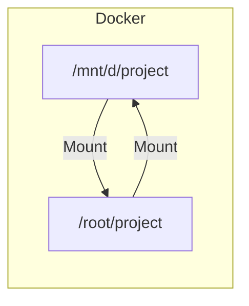

  

# 파일 시스템

[[05-secondary-storage|보조 기억 장치]]에는 수많은 파일와 디렉토리가 저장되어 있다. 운영체제는 보조 기억 장치에 저장되어 있는 것들을 어떻게 효과적으로 관리하는지 알아보자.  

## 파일과 디렉토리

**파일**은 `종이 한 장`이라고 생각하면 편하다. 각각 독립적인 자료로 이루어져 있다. 파일은 **속성 (메타데이터)** 라는 이름으로 여러 정보를 포함되어 있다.

- 파일의 속성
	- 파일의 이름, 파일을 실행하기 위한 정보, 파일의 형식, 위치, 크기 등

파일을 다루는 모든 작업은 [[08-os|운영 체제]]에 의해 이루어진다. 즉, 응용 프로그램은 임의로 파일을 할당 받아 조작, 저장이 불가능하고, 파일을 다루는 [[08.2-system-call#^b033cf|시스템 콜]]을 이용해야 한다.

프로세스가 시스템 콜을 통해 10개의 파일을 할당 받았다면, 프로세스는 할당을 받아 사용 중인 파일을 모두 구분하기 위해 **파일 디스크립터 (파일 핸들)** 를 사용한다. 

파일 디스크립터는 저수준에서 파일을 식별하는 정보이며, `0`이상의 정수 형태를 띄고 있다. 운영체제는 프로세스가 새로운 파일을 열거나 만들 때, 파일 디스크립터를 부여하여 구분하게 한다. 즉, 쉽게 말하자면 파일 디스크립터는 각 파일을 구분하게 하는 꼬리표 같은 것이다.

> [!note] 파일 디스크립터는 파일만 식별할까?
> 실제로 파일 디스크립터는 파일만 식별하지 않는다. [[06-io-devices|입출력장치]], IPC 파이프, 소켓 등도 식별한다.

**디렉토리**는 `종이 들을 모아 둔 보관함`이라고 생각하면 편하다. 도서관에서 책 한권을 찾기 위해 몇 번 복도 몇 책장의 몇 줄로 기록되어 있는 것 처럼 말이다. 최근의 모든 디렉토리는 나무 가지처럼 생겨 **트리 구조 디렉토리**로 구성되어 있다. 

디렉토리는 지도와 같은 개념을 가지고 있다. 루트 디렉토리부터 `/`를 통해 길을 나타낼 수 있다. 이것들은 **경로(Path)** 다.

여기서 운영체제는 디렉토리에 대해 특별하게 이해하는데, **운영체제**는 디렉토리를 **파일**로 간주한다는 것이다. 쉽게는 `디렉토리에 속한 요소의 관련 정보가 포함된 파일`로 말이다. 디렉토리에 속한 요소는 모두 **표**의 형태로 저장되어 있고, 테이블 형태로 표현된 정보의 행을 **디렉토리 엔트리**라고 한다.  

**디렉토리 엔트리**는 **파일의 이름**과 **파일이 저장된 위치를 유추할 수 있는 정보**를 포함한다. 이를 통해 운영체제는 보조기억장치에 저장되어 있는 위치를 알 수 있게 된다. ^bc8768

| 디렉토리 엔트리 |          |       |        |     |     |
| -------- | -------- | ----- | ------ | --- | --- |
| 파일이름     | 위치 유추 정보 | 생성 시간 | 수정된 시간 | 크기  | ... |

## 파일 할당

운영체제는 파일과 디렉토리를 **블록 (block) `4096byte`** 이라는 단위로 읽고 쓴다. 즉, 하나의 파일이 저장될 때는 하나 이상의 블록을 할당 받아 저장한다. 블록으로 저장할 때는, 연속적으로 저장하는 것이 아니라 각각의 블록이 다음 블록을 가르키는 형태로 할당한다. 이를 **연결 할당**이라고 한다.

일반적으로 [[#^bc8768|디렉토리 엔트리]]에는 파일 이름과 더불어 첫 번째 블록 주소와 블록 단위 길이가 명시되어 있다. 이를 통해 다음 블록을 연결해 가면서 관리한다. 또 다른 파일 시스템에서는 파일을 이루는 `모든`블록 주소를 `색인 블록`이라는 특별한 블록에 모아 관리하는 방식으로 할당한다. (**색인 할당**)

## 종류

여러 파일 시스템 중 어떤 시스템을 사용할지는, 보조 기억 장치를 **포매팅** 할 때 결정할 수 있다.  

- **포매팅**
	- **파일 시스템을 설정**하여 어떤 방식으로 파일을 저장하고 관리할 지 결정
	- **새로운 데이터를 쓴 준비를 하는 작업**

> [!note] 파티셔닝
> 보조기억장치에 여러 파일 시스템을 적용하려면 영역을 구분해야 한다. 이를 파티셔닝이라고 한다.
> 또한 나눠진 영역은 파티션이라고 한다.

### 아이노드 기반 파일 시스템

아이노드 기반 파일 시스템은 파일마다 각각의 **아이노드**를 갖고 있고, 각각의 번호가 부여되어 있으며 색인 할당 방식으로 저장한다. 아이노드의 대표적인 파일 시스템인 `EXT4`는 여러 블록으로 이루어져있는데, 아래와 같다.

| 이름       | 설명                                  |
| -------- | ----------------------------------- |
| 슈퍼 블록    | 아이노드 개수, 총 블록 개수, 블록 크기 등 시스템 정보 저장 |
| 그룹 식별자   | 블록 그룹에 대한 메타데이터 저장                  |
| 블록 비트맵   | 블록 그룹 내에서 데이터가 어떻게 할당되었는지 저장        |
| 아이노드 비트맵 | 현재 블록 그룹 내 아이노드가 어떻게 할당되었는지         |
| 아이노드 테이블 | 각 파일의 아이노드 정보 저장                    |
| 데이터 블록   | 각 파일의 데이터를 저장                       |

아이노드는 파티션 내 특정 영역에 모여있다. 따라 데이터 영역에 공간이 남아 있더라도, 아이노드 영역이 가득 차 할당할 수 없다면 새로운 파일을 생성할 수 없다.

> [!note] 하드 링크 vs 심볼릭 링크
> - 하드링크
> 	- 같은 아이노드 번호를 갖는 파일을 생성함. 하드 링크 파일은 원본 파일이 삭제되거나 이동되더라고 파일 데이터에 접근이 가능
> - 심볼릭링크
> 	- 같은 파일 데이터를 공유하지 않고 원본 파일의 위치만 저장하기 때문에 원본 파일이 삭제되너가 이동되면 데이터에 접근이 어렵다.

### 마운트

마운트는 어떤 저장장치의 파일 시스템에서 다른 저장장치의 파일 시스템으로 접근할 수 있도록 파일 시스템을 편입하는 작업을 의미한다. 우리가 도커파일을 생성할 때 생각하면 편하다.

   
# 참고자료
※ 이 글은 [『이것이 컴퓨터 과학이다』](https://product.kyobobook.co.kr/detail/S000214014967) 책을 기반으로, 다양한 자료를 참고해 작성했습니다.